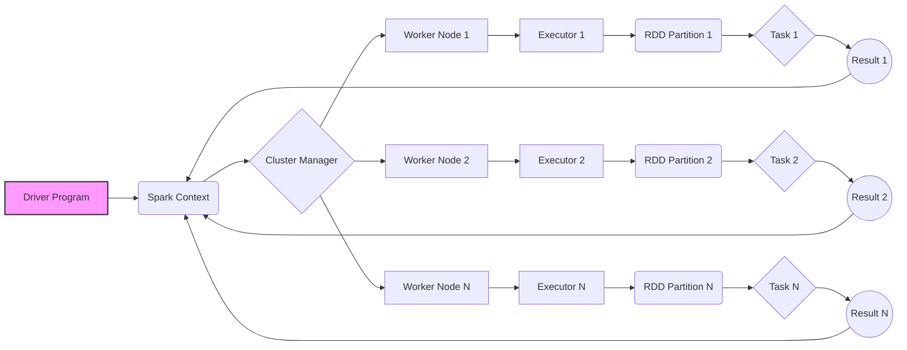

# 📄 Paper Digest: 2026-02-17

## Spark: Cluster Computing with Working Sets

| 項目 | 詳細 |
|------|------|
| **著者** | M. Zaharia, Mosharaf Chowdhury, Michael J. Franklin, S. Shenker, Ion Stoica |
| **発表年** | 2010 |
| **被引用数** | 4,911 |
| **分野** | 大規模分散処理 |
| **Semantic Scholar** | [リンク](https://www.semanticscholar.org/paper/24281c886cd9339fe2fc5881faf5ed72b731a03e) |

---

### 🎓 前提知識

*   **MapReduce:** 大量のデータを複数の計算機に分散させて並列処理を行うプログラミングモデル。データをMap関数で変換し、Reduce関数で集約するという単純な構造を持つため、大規模データ処理に広く利用されています。
*   **分散ファイルシステム (例: HDFS):** 複数の計算機にファイルを分散して保存するファイルシステム。データの冗長性を持たせることで、一部の計算機が故障してもデータが失われないように設計されています。
*   **インメモリ処理:** データ(中間データも含む)をハードディスクなどの外部ストレージではなく、メモリ上に保持したまま処理を行う手法。外部ストレージへのアクセスがボトルネックとなる処理において、大幅な高速化が期待できます。

### 📖 背景と動機

2010年当時、大規模データ処理の主流はMapReduceでした。しかし、MapReduceは各処理ステップごとにデータをディスクに書き出す必要があり、反復処理(機械学習のアルゴリズムなど)やインタラクティブなデータ分析といった、複数回データにアクセスするワークロードにおいては性能上の課題がありました。特に、機械学習アルゴリズムは、データセット全体に対して何度も処理を繰り返すため、MapReduceのディスクI/Oが大きなボトルネックとなっていました。また、複雑なクエリを実行する場合、複数のMapReduceジョブを連結する必要があり、全体の処理時間が長くなるという問題もありました。このような状況から、反復処理やインタラクティブな分析を高速化できる、新しい分散処理フレームワークが求められていました。

### 🔬 手法・アプローチ

Sparkは、メモリ上でのデータ保持(インメモリ処理)を基本とする分散処理フレームワークです。データの永続化にResilient Distributed Datasets (RDDs) という概念を導入しました。RDDsは、複数の計算機に分散されたデータの集合であり、障害回復性を持つように設計されています。Sparkは、RDDsをメモリにキャッシュすることで、反復処理においてディスクI/Oを回避し、高速な処理を実現します。また、RDDsに対する変換処理を遅延評価することで、不要な計算を避け、効率的な実行計画を立てることが可能です。さらに、MapReduceと同様に、ユーザはMapやReduceといった高レベルな操作を通して分散処理を記述できます。詳細は原論文を参照してください。

### 🏗️ アーキテクチャ図

この図は、Sparkの基本的なアーキテクチャを示しています。Driver ProgramはSpark Contextを通じてクラスタを管理し、Cluster ManagerがWorker NodeにExecutorを割り当てます。各ExecutorはRDDのPartitionを処理し、Taskを実行して結果をDriver Programに返します。

### 💡 主要な貢献

*   **Resilient Distributed Datasets (RDDs) の導入:** 不変な分散データセットであるRDDは、データの再利用を容易にし、障害からの回復を可能にしました。これにより、反復処理やインタラクティブ分析において、従来のMapReduceよりも大幅な性能向上が実現されました。
*   **インメモリ処理の活用:** 中間データをメモリに保持することで、ディスクI/Oのオーバーヘッドを削減し、処理速度を向上させました。特に、機械学習アルゴリズムなどの反復処理において大きな効果を発揮しました。
*   **遅延評価による最適化:** RDDに対する変換処理を遅延評価することで、不要な計算を避け、効率的な実行計画を立てることが可能になりました。これにより、リソースの有効活用と処理時間の短縮が実現されました。
*   **高レベルAPIの提供:** Map、Reduceといった高レベルなAPIを提供することで、分散処理のプログラミングを容易にしました。これにより、開発者は複雑な分散処理の詳細を意識することなく、アプリケーションを開発できるようになりました。

### 🌍 影響と意義

Sparkの論文は、大規模データ処理のパラダイムを大きく変え、その後の多くの研究や実務に大きな影響を与えました。4911件という高い被引用数は、Sparkが学術界と産業界の両方で非常に重要な貢献をしたことの証です。Sparkのインメモリ処理とRDDの概念は、反復処理やインタラクティブ分析を大幅に高速化し、機械学習やグラフ処理などの分野における新たなアプリケーションの可能性を切り開きました。Apache Sparkは、そのオープンソースの性質と使いやすさから広く採用され、Databricksなどの企業がSparkを基盤としたクラウドサービスを提供しています。また、Spark StreamingやSpark SQLなどのコンポーネントは、リアルタイムデータ処理やSQLによるデータ分析を可能にし、より多様なワークロードに対応できるようになりました。現在、Sparkは、データエンジニアリング、データサイエンス、機械学習など、さまざまな分野で不可欠なツールとして活用されています。

### 📚 関連キーワード

*   **Resilient Distributed Datasets (RDDs):** Sparkにおける基本的なデータ抽象化であり、不変で分散されたデータのコレクション。
*   **インメモリ処理:** データをメモリ上に保持して処理することで、ディスクI/Oのオーバーヘッドを削減し、高速な処理を実現する手法。
*   **遅延評価:** 処理の実行を必要になるまで遅らせることで、不要な計算を避け、効率的な実行計画を立てる最適化手法。
*   **分散処理:** 大量のデータを複数の計算機に分散させて並列処理を行う手法。
*   **MapReduce:** 大規模データを分散処理するためのプログラミングモデルであり、Spark以前に広く利用されていた。
*   **Apache Spark:** 大規模データ処理のためのオープンソースの分散処理フレームワーク。
*   **データエンジニアリング:** 大規模なデータ収集、加工、分析基盤の構築、運用を担う分野。
*   **機械学習:** データから学習し、予測や意思決定を行うアルゴリズムやモデルを開発する分野。

---
Auto-generated by Paper Digest workflow. Category: 大規模分散処理