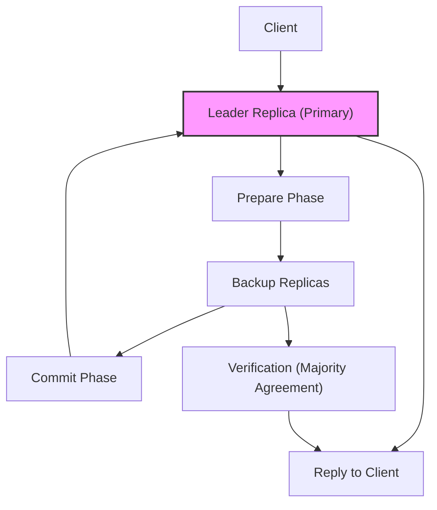

# 📄 Paper Digest: 2026-02-18

## Practical Byzantine fault tolerance

| 項目 | 詳細 |
|------|------|
| **著者** | M. Castro |
| **発表年** | 1999 |
| **被引用数** | 5,017 |
| **分野** | セキュリティ |
| **Semantic Scholar** | [リンク](https://www.semanticscholar.org/paper/8132164f0fad260a12733b9b09cacc5fff970530) |

---

### 🎓 前提知識

*   **分散システム**: 複数のコンピュータが連携して1つのシステムとして動作する仕組み。現代のWebサービスはほぼ全て分散システムで構築されている。**例えるなら、オーケストラ。各楽器（コンピュータ）が連携して美しい音楽（サービス）を奏でる必要がある。**

*   **フォールトトレランス**: システムの一部が故障しても、全体としてサービスを継続できる能力。ダウンタイムを減らし、信頼性を高めるために不可欠。**飛行機のエンジンが1つ停止しても、安全に着陸できるような冗長性だと考えればイメージしやすい。**

*   **ビザンチン故障**: 最も厄介なタイプの故障で、システムの一部が意図的に（悪意がある場合も含む）誤った情報を流す状態。通常の故障と異なり、原因の特定が非常に難しい。**例えるなら、会議でわざと嘘の情報を流す人がいるようなもの。誰が嘘をついているのか特定するのに苦労する。**

### 📖 背景と動機

当時のエンジニアたちは、クリティカルなシステムにおける信頼性の確保に頭を悩ませていた。データベースや金融システムなど、少しでも誤った情報が処理されると甚大な損害が発生する可能性があったからだ。既存のフォールトトレランス技術は、コンピュータが完全に停止する「クラッシュ故障」には効果があったものの、意図的に誤った情報を流す「ビザンチン故障」には脆弱だった。特に、敵対的な環境下でのシステム運用を考えると、悪意のある攻撃者によるデータの改ざんリスクは無視できなかった。そこで、ビザンチン故障にも耐性のある、より堅牢なシステム構築が求められていたのだ。つまり、単にシステムが止まらないだけでなく、**嘘をつくような裏切り者がいても、正しい結果を出し続ける**必要があった。

### 🔬 手法・アプローチ

一言でいえば、**複数のコンピュータが合意形成を行い、不正なコンピュータの情報を無視することで、ビザンチン故障に耐性を持つシステムを実現するアプローチ**である。

Castroらは、PBFT (Practical Byzantine Fault Tolerance) という新しい合意形成アルゴリズムを提案した。PBFTでは、まずリーダーと呼ばれるコンピュータがクライアントからのリクエストを受け、他のコンピュータ（レプリカ）に提案を送る。レプリカは提案を受け取ると、その内容に同意するかどうかをリーダーに投票する。一定数以上のレプリカが同意すれば、リクエストは承認され、処理が実行される。不正なレプリカが存在しても、正しいレプリカの多数決によって誤った情報が排除される仕組みだ。重要なのは、この合意形成プロセスを効率的に行うために、デジタル署名などの暗号技術を組み合わせている点だ。

しかし、PBFTにもトレードオフはある。レプリカ間の通信コストが増加するため、参加するコンピュータの数が増えるほどパフォーマンスが低下しやすい。つまり、**高い信頼性を得る代わりに、処理速度が犠牲になる**という側面がある。それでも、極めて重要なシステムにおいては、その信頼性の高さからPBFTは採用する価値のある選択肢だったのだ。

### 🏗️ アーキテクチャ図

この図は、PBFTにおけるクライアントからのリクエスト処理の流れを示しています。クライアントはまずリーダーにリクエストを送り、リーダーは他のレプリカとPrepareフェーズ、Commitフェーズを経て合意形成を行います。最終的に、リーダーはクライアントに応答を返します。レプリカは、多数決によって正当性を検証(Verification)してから、リーダーに結果を返します。

### 💡 主要な貢献

*   **ビザンチン故障耐性を持つ実用的な合意形成アルゴリズムを提案** — 従来の研究は理論的なものが多かったのに対し、PBFTは現実的なシステムで利用可能な性能を実現した。
*   **ステートマシンレプリケーションへの適用** — PBFTをステートマシンレプリケーションに適用することで、分散システム全体の信頼性を向上させる方法を示した。
*   **メッセージ認証コード (MAC) を活用した効率的なメッセージ認証** — デジタル署名だけでなく、メッセージ認証コード (MAC) を利用することで、パフォーマンスを向上させた。
*   **実際のシステムにおける性能評価** — 実験を通じて、PBFTの性能特性を明らかにし、パラメータ調整の指針を示した。

### 🌍 影響と意義

この論文は、分散合意形成の分野に大きな影響を与え、後のブロックチェーン技術の発展に貢献しました。被引用数が5000を超えるのは、PBFTが初めて実用的なビザンチン故障耐性を持つ合意形成アルゴリズムを提示し、分散システムにおける信頼性の問題を解決する道を開いたからです。PBFTの考え方は、Quorum Blockchain Service (QBS) など、企業向けのプライベートブロックチェーンや許可型ブロックチェーンで利用されています。また、PBFTの概念は、分散データベースやクラウドサービスの基盤技術にも影響を与え、高可用性システムの構築に貢献しています。

### 📚 関連キーワード

*   **Byzantine Fault Tolerance (BFT)**: システムの一部がビザンチン故障を起こしても、システム全体が正しい動作を維持できる性質。
*   **Distributed Consensus**: 分散システムにおいて、複数のノードが単一の値について合意するプロセス。
*   **State Machine Replication**: 複数のレプリカが同じ状態機械を複製し、同じ順序で処理を実行することで、高い信頼性を実現する技術。
*   **Message Authentication Code (MAC)**: メッセージの完全性を保証するために使用される暗号技術。
*   **Blockchain**: 分散型台帳技術であり、PBFTのような合意形成アルゴリズムを用いてトランザクションの正当性を検証する。
*   **Practical Byzantine Fault Tolerance (PBFT)**: 本論文で提案された、ビザンチン故障耐性を持つ実用的な合意形成アルゴリズム。
*   **Tendermint**: ブロックチェーンのコンセンサスエンジンであり、PBFTに影響を受けたBFTアルゴリズムを使用している。
*   **Quorum Blockchain Service (QBS)**: Oracleが提供するブロックチェーンサービスで、PBFTをベースとした合意形成アルゴリズムを使用している。

---
Auto-generated by Paper Digest workflow. Category: セキュリティ