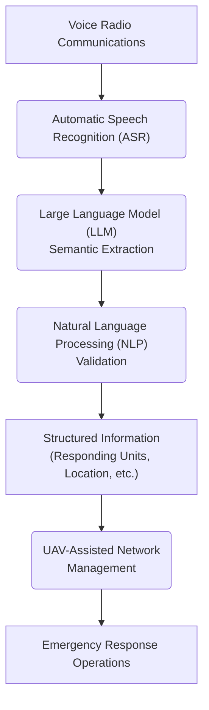

# 📄 Paper Digest: 2026-02-20

## Voice-Driven Semantic Perception for UAV-Assisted Emergency Networks

| 項目 | 詳細 |
|------|------|
| **著者** | Nuno Saavedra, Pedro Ribeiro, Andr\'e Coelho, Rui Campos |
| **発表日** | 2026-02-20T00:00:00-05:00 |
| **分野** | クラウド |
| **arXiv** | [リンク](https://arxiv.org/abs/2602.17394) |
| **PDF** | [リンク](https://arxiv.org/pdf/2602.17394) |

---

### 🎓 前提知識

*   **自動音声認識 (ASR):** 人間の音声をコンピュータが理解できるテキストデータに変換する技術。まるで、あなたの話す内容をリアルタイムで文字起こししてくれる高性能な秘書だ。
*   **大規模言語モデル (LLM):** 大量のテキストデータから学習し、自然な文章の生成や翻訳、質問応答など、高度な言語処理タスクを実行できるAIモデル。例えば、過去の膨大な文学作品を読み込んだAIが、まるでシェイクスピアのような詩を自動生成するイメージだ。
*   **自然言語処理 (NLP):** 人間の言語をコンピュータが理解・処理するための技術全般。メールのフィルタリングやチャットボットなど、身の回りの様々なところで使われている。例えば、あなたが「明日の天気を教えて」とスマホに話しかけると、NLPがその意図を理解し、天気予報を表示してくれる。

### 📖 この研究が解こうとしている問題

災害現場では、インフラが破壊され通信手段が限られるため、無線による音声通信が重要な役割を果たす。しかし、音声通信は構造化されていないため、UAV（ドローン）支援ネットワークの自動管理に直接統合できないという課題がある。例えば、消防士が「A地点で火災発生、応援を要請」と無線で伝えても、従来のシステムではその情報を自動的に地図上に反映したり、最適なドローンの派遣ルートを計算したりすることが難しい。結果として、状況把握の遅れや対応の遅延を招き、救助活動の効率が低下する可能性がある。この論文は、まさにこの問題を解決し、音声情報をUAVネットワークが活用できる形に変換することを目指している。

### 🔬 手法・アプローチ

一言でいえば、**緊急時の音声通信をAIで解析し、ドローン支援ネットワークが状況を理解・対応できるようにするアプローチである**。

具体的には、まずASRを用いて音声データをテキストに変換する。次に、LLMを活用してテキストから重要な意味情報（例：場所、緊急度、必要なリソース）を抽出する。最後に、NLP技術で抽出された情報の妥当性を検証する。この一連のプロセスを経ることで、例えば「負傷者あり、B地点に救急隊を派遣」という無線メッセージが、システムによって「B地点に救急隊派遣が必要」という構造化されたデータに変換される。そして、その情報に基づいてドローンが自動的に現場に急行したり、最適なルートを指示したりといった対応が可能になる。

ただし、このアプローチにはトレードオフもある。**音声認識の精度は騒音や方言に左右されるし、LLMによる意味抽出も100%正確とは限らない**。特に、複数の話者が同時に発言した場合（speaker diarization）や、曖昧な地理的表現（例：「あそこの建物」）が含まれる場合は、精度が低下する可能性がある。つまり、迅速な状況把握と自動化された対応というメリットを得る代わりに、一定の誤認識リスクを受け入れる必要がある。

### 🏗️ アーキテクチャ図

この図は、SIRENフレームワークにおける音声データから緊急対応オペレーションまでの情報の流れを示しています。音声通信はASRによってテキスト化され、LLMで意味抽出、NLPで検証された後、UAVネットワーク管理に利用されます。

### 💡 主要な貢献

*   **音声駆動型セマンティック知覚の実現** — 緊急時の音声通信を構造化された情報に変換し、UAV支援ネットワークでの状況認識を可能にした。
*   **AI駆動型フレームワークSIRENの提案** — ASR、LLM、NLPを統合し、音声データから緊急対応に必要な情報を抽出するフレームワークを開発した。
*   **多様な条件下でのロバスト性の検証** — 言語、話者数、背景雑音、メッセージ複雑性の変動に対するSIRENの性能を評価し、実用的な信頼性を示した。
*   **主要な制限要因の特定** — 話者ダイアリゼーションと地理的曖昧さが、システム全体の精度に影響を与える主要な要因であることを明らかにした。

### 🌍 実務への応用可能性

この研究成果は、災害対応、建設現場、警備システムなど、音声通信が重要な役割を果たす様々な実務に応用できます。例えば、建設現場での作業指示や状況報告をAIが解析し、作業の進捗管理や安全管理に役立てることができます。また、警備システムにおいては、異常事態の発生場所や種類を音声から自動的に特定し、適切な対応を迅速に行うことができます。既存の音声認識API（Google Cloud Speech-to-Text、Amazon Transcribeなど）や自然言語処理プラットフォーム（Hugging Face Transformersなど）と組み合わせることで、比較的容易にプロトタイプを開発できます。プロジェクトに取り入れる場合は、まず特定のユースケースを選定し、そのユースケースに特化した音声データセットを収集・アノテーションすることから始めるのが良いでしょう。

### 📚 関連キーワード

*   **Automatic Speech Recognition (ASR)** — 音声をテキストに変換する技術。クラウドAPIとして広く利用可能。
*   **Large Language Model (LLM)** — 大規模なテキストデータで学習された自然言語処理モデル。質問応答やテキスト生成に利用される。
*   **Natural Language Processing (NLP)** — コンピュータが人間の言語を理解し処理するための技術。
*   **Unmanned Aerial Vehicle (UAV)** — 無人航空機。ドローンとも呼ばれ、監視、配達、災害対応など幅広い用途で使用される。
*   **Speaker Diarization** — 音声データ中の話者を識別し、発言区間を特定する技術。複数話者が同時に話す状況で重要となる。
*   **Geographic Information System (GIS)** — 地理空間情報を管理、分析、可視化するためのシステム。抽出された位置情報を地図上に表示する際に活用できる。
*   **Edge Computing** — データ処理をデータ発生源の近くで行う技術。UAVに搭載されたデバイスで処理を行うことで、通信遅延を削減し、リアルタイム性を高める。

---
Auto-generated by Paper Digest workflow. Category: クラウド