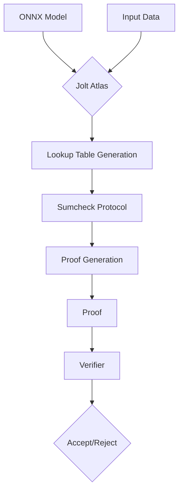

# 📄 Paper Digest: 2026-02-22

## Jolt Atlas: Verifiable Inference via Lookup Arguments in Zero Knowledge

| 項目 | 詳細 |
|------|------|
| **著者** | Wyatt Benno, Alberto Centelles, Antoine Douchet, Khalil Gibran |
| **発表日** | 2026-02-19T15:17:18Z |
| **分野** | セキュリティ |
| **arXiv** | [リンク](https://arxiv.org/abs/2602.17452v1) |
| **PDF** | [リンク](https://arxiv.org/pdf/2602.17452v1) |

---

### 🎓 前提知識

1.  **零知識証明（Zero-Knowledge Proof, ZKP）**: ある人が、相手に何も情報（知識）を伝えずに、自分が何かを知っていることを証明する技術です。例えば、あなたは数独を解けることを、答えを教えずに相手に証明できます。**現実世界のたとえ**：鍵付きの箱を使って、自分がその鍵を持っていることを証明するようなもの。箱の中身は見せずに、鍵を持っていることだけを相手に確信させます。

2.  **ONNX（Open Neural Network Exchange）**: 異なる機械学習フレームワーク（PyTorch, TensorFlowなど）間でモデルを共有するための共通フォーマットです。これにより、あるフレームワークで学習したモデルを別のフレームワークで実行できます。**現実世界のたとえ**：様々な国の人が書いたレシピを、共通の言語（ONNX）で翻訳して、どの国の料理人でもそのレシピを使って料理できるようにするイメージです。

3.  **Lookup Arguments**: 計算の正しさを、事前に計算された表（Lookup Table）との比較を通じて検証する手法です。複雑な計算を、テーブルから対応する値を探すという簡単な操作に置き換えることで、証明を効率化します。**現実世界のたとえ**：税金の計算を、複雑な計算式ではなく、所得に応じた税額が記載された税率表を参照して行うようなものです。

### 📖 この研究が解こうとしている問題

AIモデルの推論結果を検証可能にすることには大きな価値があります。例えば、医療診断AIが特定の診断結果を出したとき、その根拠を第三者が検証できれば、AIの透明性と信頼性が向上します。しかし、既存のzkML（Zero-Knowledge Machine Learning）フレームワークは、計算コストが非常に高く、実用的な規模のモデルには適用できませんでした。特に、複雑なニューラルネットワークの推論を、限られたリソースしかないデバイス（例えば、スマートフォンやIoTデバイス）で証明するのは困難です。また、既存のzkMLの多くは、特定のフレームワークに依存しており、モデルの移植性が低いという問題もありました。これらの課題を解決し、より幅広いAIモデルを、リソース制約のある環境でも、安全かつ検証可能に実行できる基盤が求められています。

### 🔬 手法・アプローチ

一言でいえば、**ONNX形式のMLモデルを、JoltのLookup Argumentsを応用して効率的に零知識証明可能にするアプローチ**です。

Jolt Atlasでは、まずMLモデルをONNX形式に変換します。ONNXは、モデル構造と演算をグラフとして表現するため、CPUの命令セットをエミュレートするzkVM（Zero-Knowledge Virtual Machine）を使用する代わりに、直接ONNXのテンソル演算を検証できます。これにより、レジスタやメモリの一貫性といった複雑な検証を回避し、証明の効率を大幅に向上させています。さらに、Jolt Atlasは、sumcheckプロトコルを用いたLookup Argumentsを最適化し、非線形関数（ニューラルネットワークの重要な要素）の証明を効率化します。また、「ニューラルテレポーテーション」という技術を用いて、Lookup Tableのサイズを削減し、モデルの精度を維持します。この手法は、メモリ制約のある環境での証明を可能にする「ストリーミング」という重要な特性を実現します。

**トレードオフ**として、Jolt Atlasは、汎用的な計算を証明できるzkVMと比較して、対象とする計算が機械学習の推論に限定されます。しかし、その分、特定のワークロードに特化することで、既存のzkMLフレームワークよりも大幅に効率的な証明を可能にしました。これにより、AIの透明性とプライバシー保護を両立させる新たな可能性が開かれます。

### 🏗️ アーキテクチャ図

この図は、Jolt Atlasにおける零知識証明の生成と検証のプロセスを示しています。ONNXモデルと入力データがJolt Atlasに入力され、Lookup Table生成とSumcheck Protocolを経て証明が生成されます。生成された証明はVerifierによって検証され、AcceptまたはRejectの結果が出力されます。

### 💡 主要な貢献
*   **ONNXを用いたzkMLフレームワークの実現** — 既存のzkVMアプローチではなく、ONNXのテンソル演算に直接適用することで、証明の効率を向上させた。
*   **非線形関数の効率的な証明** — sumcheckプロトコルを用いたLookup Argumentsの最適化により、ニューラルネットワークにおける非線形関数の証明を高速化した。
*   **ニューラルテレポーテーションによるLookup Tableのサイズ削減** — モデル精度を維持しながらLookup Tableのサイズを削減し、メモリ制約のある環境での証明を可能にした。
*   **ストリーミング証明の実現** — メモリ制約のある環境でもモデル推論の証明が可能な「ストリーミング」特性を実現した。
*   **実用的な証明時間の達成** — 分類、埋め込み、自動推論、小規模言語モデルなど、多様なMLタスクで実用的な証明時間を達成した。

### 🌍 実務への応用可能性
Jolt Atlasは、AIモデルの推論結果に対する信頼性とプライバシー保護が求められる場面で活用できます。例えば、金融取引における不正検知AIモデルの判断根拠を、機密情報を開示せずに証明する、医療診断AIの結果を患者のプライバシーを保護しながら検証する、といった応用が考えられます。既存のMLフレームワークと連携し、ONNX形式でエクスポートされたモデルをJolt Atlasで処理することで、証明可能な推論を実現できます。開発者は、まず既存のモデルをONNX形式に変換し、Jolt AtlasのAPIを用いて証明を生成・検証するプロトタイプを開発することから始められます。VegaのBlindFold技術と組み合わせることで、モデルのパラメータ自体を秘匿したまま推論の正当性を証明することも可能です。

### 📚 関連キーワード
*   **Zero-Knowledge Machine Learning (zkML)**: 機械学習モデルの推論や学習を、データのプライバシーを保護しながら検証可能にする技術分野。
*   **ONNX (Open Neural Network Exchange)**: 異なる機械学習フレームワーク間でモデルを共有するためのオープンなフォーマット。モデルの互換性を高める。
*   **Lookup Arguments**: 計算の正しさを検証するために、事前に計算された表との比較を利用する手法。証明の効率化に貢献する。
*   **Sumcheck Protocol**: 多項式の和を効率的に検証するための対話型証明プロトコル。Jolt AtlasではLookup Argumentsの効率化に利用される。
*   **Neural Teleportation**: ニューラルネットワークの構造を変換し、Lookup Tableのサイズを削減する最適化技術。
*   **zkVM (Zero-Knowledge Virtual Machine)**: 汎用的な計算を零知識で証明できる仮想マシン。Jolt AtlasはzkVMではなく、特定の計算（ML推論）に特化することで効率化を図る。
*   **BlindFold**: Vegaで導入された、モデルのパラメータを秘匿したまま推論の正当性を証明する技術。
*   **Homomorphic Encryption (準同型暗号)**: 暗号化されたデータに対して演算を行い、その結果を復号することで、平文での演算結果と同じ結果を得られる暗号技術。zkMLの代替技術。

---
Auto-generated by Paper Digest workflow. Category: セキュリティ