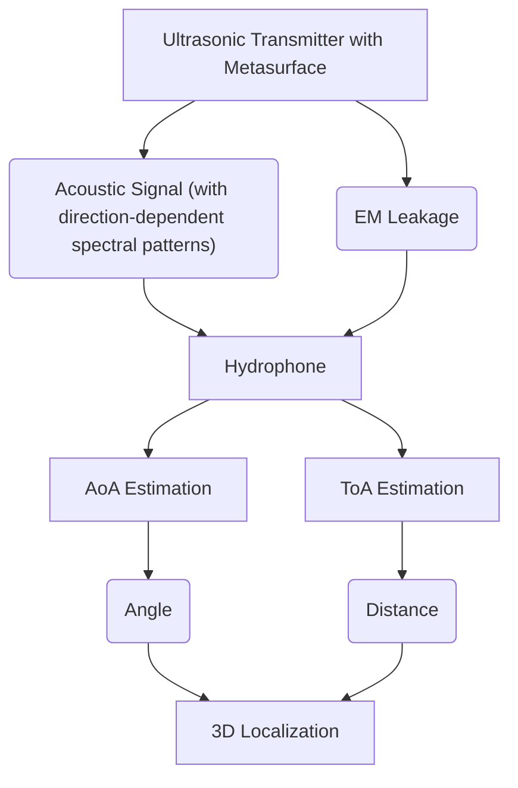

# 📄 Paper Digest: 2026-02-24

## MetaBlue: A Metasurface-Assisted Acoustic Underwater Localization System

| 項目 | 詳細 |
|------|------|
| **著者** | Junling Wang, Yi Guo, Bojun Yang, Yazhou Yuan, Zhenlin An |
| **発表日** | 2026-02-24T00:00:00-05:00 |
| **分野** | クラウド |
| **arXiv** | [リンク](https://arxiv.org/abs/2602.19252) |
| **PDF** | [リンク](https://arxiv.org/pdf/2602.19252) |

---

### 🎓 前提知識

*   **音響測位:** 音波を使って物体の位置を特定する技術。カーナビがGPS衛星からの電波で現在地を把握するのと同じで、こちらは水中版。ただし、電波は水中ではすぐに減衰してしまうため、音波が使われる。
*   **メタサーフェス:** 特殊な構造を持つ人工的な素材で、音波や電磁波の挙動を自在に操れる。例えば、光のレンズのように、音波の進む方向をコントロールできる「音響レンズ」のようなものをイメージするとわかりやすい。
*   **Angle-of-Arrival (AoA):** 音源から受信機に音が届く角度のこと。サッカーの試合で、観客席からボールが蹴られた方向を特定するようなもの。複数の受信機があれば、その角度から音源の位置を推定できる。

### 📖 この研究が解こうとしている問題

水中でロボットを自律的に動かしたり、海洋資源を調査したりするには、正確な位置情報が不可欠だ。しかし、水中で使えるGPSのようなものは存在しない。電波はすぐに減衰してしまうし、光も濁った水中では遠くまで届かないからだ。そのため、音波を使った音響測位が有力な手段となる。従来の音響測位システムは、複数の水中マイク（ハイドロホン）を広い範囲に設置したり、複数の音源を同期させたりする必要があり、コストがかかるし、設置も大変だった。特に、浅瀬や入り組んだ地形では、設置場所の確保が難しい。この論文では、もっと手軽に、低コストで使える水中測位システムを目指している。

### 🔬 手法・アプローチ

一言でいえば、**メタサーフェスを使って音響信号に「指紋」を付与し、電磁波リークをトリガーにして高精度な距離を測るアプローチ**だ。

まず、音響送信機に特殊なメタサーフェスを取り付ける。このメタサーフェスは、音波の放射パターンを変化させ、特定の方向に特有の周波数パターンを埋め込む。受信側のハイドロホンは、この周波数パターンを解析することで、音源からの角度（AoA）を高精度に推定できる。つまり、メタサーフェスが、音源に方向ごとの識別子を付与するようなイメージだ。

次に、距離の測定には、音響トランスデューサーから漏れ出る微弱な電磁波を利用する。音響信号と同時に発せられるこの電磁波を、音響信号の到達時間（ToA）を測るためのトリガーとして使う。電磁波は水中でも高速に伝わるため、正確なタイミングの基準として利用できるのだ。これによって、複数の機器間で厳密な時刻同期を取る必要がなくなる。

**トレードオフ**としては、メタサーフェスの設計と調整に専門知識が必要となる点や、電磁波リークを利用するため、特定の音響トランスデューサーに依存する可能性がある点が挙げられる。しかし、それと引き換えに、低コストで高精度な3次元測位を、シングルアンカーで実現できるという大きなメリットが得られる。

### 🏗️ アーキテクチャ図

この図は、MetaBlueシステムのアーキテクチャを示しています。メタサーフェス付きの超音波送信機（A）から発せられた音響信号（B）と電磁波リーク（C）を、ハイドロホン（D）で受信し、AoA（E）とToA（F）を推定します。これらの情報から最終的に3D位置情報（I）を算出します。

### 💡 主要な貢献

*   **低コストな水中3D測位を実現** — 単一の音響アンカーとハイドロホンのみで、従来システムと同等の精度を実現し、ハードウェアコストと設置の複雑さを大幅に削減した。
*   **音響メタサーフェスによる指向性制御** — 特殊なメタサーフェス設計により、音響信号に角度依存のスペクトルパターンを埋め込み、高精度なAoA推定を可能にした。
*   **EM-音響混合ToA法** — 音響トランスデューサーからの電磁波リークをタイミングリファレンスとして利用することで、複数の機器間での厳密な時刻同期を不要にした。
*   **多様な水中環境下での有効性** — プール、水槽、屋外環境など、様々な条件下で実験を行い、提案システムのロバスト性と実用性を示した。

### 🌍 実務への応用可能性

MetaBlueシステムは、水中ロボットの自律航行、海洋資源探査、水中構造物の検査など、様々な分野での応用が期待できます。例えば、養殖場の監視や水中インフラのメンテナンスにおいて、低コストで高精度な位置情報を提供できます。既存のロボット制御システムやデータ解析ツールと組み合わせることで、より高度な自律運用を実現できます。プロジェクトに取り入れるには、まず市販の超音波トランスデューサーに適用可能なメタサーフェスを設計・製作し、EMリークの特性を評価することから始めるのが良いでしょう。また、ROS (Robot Operating System) のようなロボットプラットフォームと統合することで、実用的な水中ロボットシステムを構築することも可能です。

### 📚 関連キーワード

*   **Underwater Acoustic Communication:** 水中での音波を利用したデータ伝送技術。MetaBlueは測位だけでなく、通信と組み合わせることで、より高度な水中ネットワークを構築できる可能性がある。
*   **Time Difference of Arrival (TDOA):** 複数の受信機への到達時間差を利用して位置を特定する技術。MetaBlueのAoA推定と組み合わせることで、よりロバストな測位システムが実現できる。
*   **Beamforming:** 複数の音源や受信機からの信号を合成し、特定の方向に感度を高める技術。MetaBlueのメタサーフェスによる指向性制御と組み合わせることで、より効率的な音響センシングが可能になる。
*   **Simultaneous Localization and Mapping (SLAM):** 自己位置推定と環境地図作成を同時に行う技術。MetaBlueをSLAMシステムに組み込むことで、未知の環境下での自律航行性能を向上させることができる。
*   **Internet of Underwater Things (IoUT):** 水中におけるセンサーやデバイスをネットワークで接続する概念。MetaBlueはIoUTの基盤技術として、水中環境モニタリングや資源管理に貢献できる。
*   **Computational Acoustics:** 音響現象のシミュレーションや解析を行う分野。MetaBlueのメタサーフェス設計において、数値シミュレーションを活用することで、より高性能なデバイスを開発できる。
*   **Acoustic Metamaterials:** 人工的に設計された構造体で、自然界には存在しない音響特性を実現する材料。MetaBlueのメタサーフェスは、この分野の応用例と言える。

---
Auto-generated by Paper Digest workflow. Category: クラウド