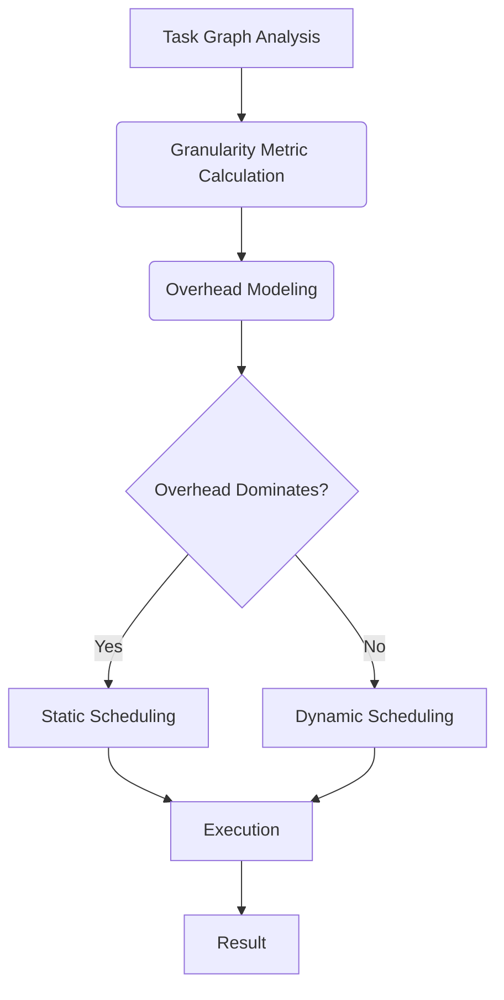

# 📄 Paper Digest: 2026-02-25

## A Granularity Characterization of Task Scheduling Effectiveness

| 項目 | 詳細 |
|------|------|
| **著者** | Sana Taghipour Anvar, David Kaeli |
| **発表日** | 2026-02-25T00:00:00-05:00 |
| **分野** | 大規模分散処理 |
| **arXiv** | [リンク](https://arxiv.org/abs/2602.20561) |
| **PDF** | [リンク](https://arxiv.org/pdf/2602.20561) |

---

### 🎓 前提知識

*   **タスクベース並列処理**: 大きな問題を小さなタスクに分割し、並行して実行する手法のこと。例えば、Webサイトの画像処理を考えてみよう。ユーザーがアップロードした画像をリサイズしたり、圧縮したりする処理を、個別のタスクとして複数のサーバーに分散して行うイメージだ。
*   **ストロングスケーリング**: 並列処理において、問題サイズを固定したままプロセッサ数を増やした場合の性能向上を指す。これは、料理に例えると、ケーキのサイズを変えずに、調理する人数を増やして焼き時間を短縮できるかどうか、という話に似ている。理想的には人数に比例して時間が短縮されるべきだが、実際にはコミュニケーションコストなどにより効率が落ちる場合がある。
*   **タスクグラフ**: タスク間の依存関係をグラフで表現したもの。タスクの実行順序を視覚的に理解するのに役立つ。例えば、家の建築プロジェクトを想像してみよう。基礎工事が終わらないと壁は作れないし、壁が終わらないと屋根は取り付けられない。この依存関係を整理したものがタスクグラフだ。

### 📖 この研究が解こうとしている問題

大規模な分散処理システムでは、処理を細かく分割して並列実行することで高速化を狙うのが一般的だ。しかし、並列度を上げれば上げるほど、タスクのスケジューリングにかかるオーバーヘッドが無視できなくなるという問題がある。つまり、プロセッサを増やせば処理は早くなるはずなのに、実際にはスケジューリングのコストがボトルネックとなり、思ったほど性能が向上しない、あるいは逆に性能が低下してしまうという状況が起こりうるのだ。この現象は、アルゴリズムの種類やタスクの粒度によって大きく異なり、経験的に観測されてはいるものの、その根本的な原因はよく分かっていなかった。既存の手法では、問題サイズだけに注目しがちだが、アルゴリズムの構造、特にタスク間の依存関係が性能に与える影響を考慮できていないため、最適な並列化戦略を事前に予測することが難しかった。

### 🔬 手法・アプローチ

この研究は、**タスクグラフの依存関係トポロジーに着目することで、スケジューリングのオーバーヘッドが性能に与える影響を定量的に評価する**アプローチだ。

まず、タスクグラフの構造を分析し、スケジューリングのオーバーヘッドが並列計算によって相殺される場合と、オーバーヘッドが性能を支配してしまう場合を区別する「粒度メトリクス」を提案した。このメトリクスを用いることで、問題サイズだけでなく、アルゴリズムの構造が並列化の効率にどのように影響するかを理解できる。次に、この粒度メトリクスに基づいてオーバーヘッドモデルを構築し、ストロングスケーリングの限界を予測することに成功している。そして、この予測に基づき、動的なスケジューリングと静的なスケジューリングを、実行時に自動で選択する意思決定ルールを考案した。

このアプローチのトレードオフとして、タスクグラフの構造分析という追加のステップが必要になる。しかし、事前に詳細なストロングスケーリングの調査や、オフラインでのチューニングを行うことなく、最適な並列化戦略を選択できるため、結果として開発や運用にかかるコストを削減できるといえるだろう。

### 🏗️ アーキテクチャ図

この図は、提案されたフレームワークの全体的な流れを示しています。タスクグラフ分析から始まり、粒度メトリクスの計算、オーバーヘッドのモデリングを経て、動的または静的なスケジューリングの選択を行い、最後に実行と結果の出力に至ります。

### 💡 主要な貢献

*   **タスクグラフの依存関係トポロジーに基づく粒度特性評価フレームワークを導入** — 従来の問題サイズだけでなく、タスクグラフの構造がスケジューリングオーバーヘッドに与える影響を定量的に評価できるようになった。
*   **粒度メトリクスを提案** — スケジューリングオーバーヘッドが並列計算によって相殺されるか、性能を支配するかを判断するための指標を提供し、アルゴリズムの構造が並列化効率に与える影響を理解するのに役立つ。
*   **オーバーヘッドモデルを構築し、ストロングスケーリングの限界を予測** — 実験結果から、依存関係トポロジーから導出されたオーバーヘッドモデルが、ストロングスケーリングの限界を正確に予測できることを示した。
*   **実行時の動的/静的スケジューリング選択ルールを開発** — 事前の詳細な調査やオフラインチューニングなしに、実行時に最適なスケジューリング戦略を自動的に選択できる実用的な意思決定ルールを確立した。

### 🌍 実務への応用可能性

この研究成果は、大規模なデータ処理やシミュレーションを行うシステムにおいて、タスクスケジューリングの最適化に役立ちます。例えば、機械学習の学習パイプラインや、科学技術計算のワークフローなど、タスク間の依存関係が複雑な処理を効率的に実行したい場合に有効です。既存のタスクベース並列処理フレームワーク（例：Dask, Ray）に組み込むことで、タスクグラフの構造を解析し、動的にスケジューリング戦略を切り替える機能を追加できます。開発者は、まず自社のワークロードのタスクグラフを可視化し、提案された粒度メトリクスを適用して、オーバーヘッドが支配的になる並列度を特定することから始められます。これにより、無駄な並列化を避け、システム全体のパフォーマンスを向上させることが期待できます。

### 📚 関連キーワード

*   **Task-based Parallelism**: 大きな問題を小さなタスクに分割し、並行して実行するプログラミングモデル。
*   **Strong Scaling**: 問題サイズを固定したまま、プロセッサ数を増やした場合の性能向上を評価する指標。
*   **Task Graph**: タスク間の依存関係を表現するグラフ構造で、タスクの実行順序やデータの流れを視覚化するのに役立つ。
*   **Dask**: Pythonで並列処理を容易にするための柔軟なライブラリで、タスクスケジューリングやデータ管理をサポートする。
*   **Ray**: 大規模な機械学習やAIアプリケーション向けに設計された分散処理フレームワークで、動的なタスクグラフを効率的に実行できる。
*   **Workflow Management System**: 科学ワークフローやデータパイプラインの設計、実行、監視を自動化するシステム（例: Apache Airflow, Argo Workflows）。
*   **DAG (Directed Acyclic Graph)**: 閉路を持たない有向グラフで、タスクの依存関係を表現するために広く用いられる。
*   **Dynamic Scheduling**: 実行時にタスクの実行順序やリソース割り当てを決定するスケジューリング戦略。

---
Auto-generated by Paper Digest workflow. Category: 大規模分散処理