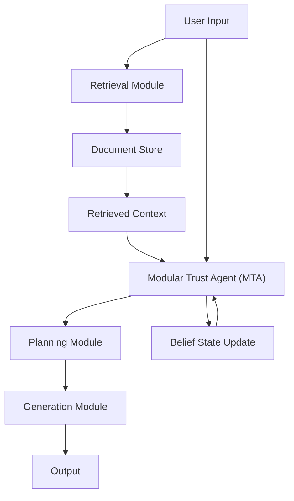

# 📄 Paper Digest: 2026-02-26

## Adversarial Intent is a Latent Variable: Stateful Trust Inference for Securing Multimodal Agentic RAG

| 項目 | 詳細 |
|------|------|
| **著者** | Inderjeet Singh, Vikas Pahuja, Aishvariya Priya Rathina Sabapathy, Chiara Picardi, Amit Giloni 他6名 |
| **発表日** | 2026-02-26T00:00:00-05:00 |
| **分野** | セキュリティ |
| **arXiv** | [リンク](https://arxiv.org/abs/2602.21447) |
| **PDF** | [リンク](https://arxiv.org/pdf/2602.21447) |

---

### 🎓 前提知識

*   **RAG (Retrieval-Augmented Generation):** RAGは、LLM（大規模言語モデル）に外部の知識を組み込んで、より正確で信頼性の高い回答を生成する技術です。質問に関連する情報をデータベースから検索し、その情報と質問を組み合わせてLLMに入力します。**たとえば、会社のFAQをRAGでLLMに提供することで、LLMはFAQの内容に基づいた正確な回答を生成できます。**
*   **マルチモーダル:** マルチモーダルとは、テキストだけでなく、画像、音声、動画など、複数の種類の情報を扱うことです。マルチモーダルLLMは、これらの様々な情報を組み合わせて理解し、質問に答えることができます。**たとえば、画像を見て「この写真に写っている猫の種類は？」と質問できるようなイメージです。**
*   **敵対的攻撃 (Adversarial Attack):** 機械学習モデルを欺くために、巧妙に細工された入力データを使用する攻撃です。特にLLMの場合、プロンプトを少し変えるだけで、意図しない回答や有害なコンテンツを生成させることが可能です。**例えるなら、テストの裏をかくような、ずる賢い質問の仕方です。**

### 📖 この研究が解こうとしている問題

RAGシステムは、LLMの知識不足を補い、最新の情報を提供するために非常に有効ですが、悪意のある攻撃に対して脆弱です。特に、マルチモーダルなRAGシステムでは、攻撃者が画像やテキストを組み合わせて、システムに有害な情報を注入する可能性があります。現状のセキュリティ対策は、個々の段階でのチェックに留まっており、攻撃者が情報を少しずつ分散させて注入する戦略には対応できていません。例えば、まず無害な情報を検索させ、次に悪意のある情報を少しずつ追加していくような攻撃です。このような複雑な攻撃は、従来の防御策では検知が難しく、システム全体を危険に晒す可能性があります。つまり、RAGシステム全体の文脈を理解し、攻撃者の意図を推測できる、より高度な防御システムが求められているのです。

### 🔬 手法・アプローチ

この研究は、**RAGシステムに対する敵対的な攻撃を、システムの状態を考慮して防御するアプローチ**を提案しています。

研究では、攻撃者の意図を「隠れた変数」とみなし、システムの状態を監視することで、その意図を推測します。具体的には、Modular Trust Agent (MTA)と呼ばれるモジュールを導入し、LLMの推論能力を活用して、RAGシステムの各段階（検索、計画、生成）での信頼度を評価します。このMTAは、システム内部の様々なチェックポイントを監視し、得られた情報を基に「信念状態」を更新していきます。この「信念状態」は、システムが攻撃されている可能性を数値化したものです。

そして、この信念状態に基づいて、RAGシステムの挙動を調整することで、攻撃を未然に防ぎます。従来の防御策は、個々の段階でのチェックに留まっていましたが、このアプローチでは、システム全体の状態を考慮することで、より高度な攻撃を検知できるようになります。

**トレードオフ**として、このアプローチは計算コストが増加します。しかし、攻撃成功率を大幅に減少させることができるため、セキュリティを重視するシステムにとっては、十分価値のある投資と言えるでしょう。

### 🏗️ アーキテクチャ図

この図は、ユーザー入力から始まり、検索、計画、生成の各モジュールを経て最終的な出力を生成するRAGシステムの基本的な流れを示しています。Modular Trust Agent (MTA)は、各段階を監視し、信念状態を更新することで、システム全体の信頼性を管理します。

### 💡 主要な貢献
*   **敵対的意図を潜在変数としてモデル化** — 従来の防御策では対応が難しかった、分散された悪意のある情報を注入する攻撃への対策として、攻撃者の意図を確率的に推測する新しいアプローチを提案した。
*   **Stateful Trust Inferenceの導入** — RAGシステムの各段階を監視し、その状態を考慮することで、攻撃の可能性をより正確に評価するフレームワーク（MMA-RAG^T）を開発した。
*   **Modular Trust Agent (MTA) の設計** — LLMの推論能力を活用し、RAGシステムの各段階での信頼度を評価し、信念状態を更新するモジュールを設計した。
*   **既存のRAGシステムへの統合容易性** — MMA-RAG^Tは、モデルに依存しないオーバーレイとして機能するため、既存のRAGシステムに容易に組み込むことが可能である。

### 🌍 実務への応用可能性
この研究成果は、特に機密情報や重要な意思決定を扱うRAGシステムのセキュリティを強化するために活用できます。たとえば、顧客サポート、金融分析、法務調査など、誤った情報や悪意のある情報が重大な損害を引き起こす可能性がある分野で有効です。既存のRAGシステムにMMA-RAG^Tを組み込むことで、攻撃成功率を大幅に低減し、システムの信頼性を向上させることができます。具体的には、LangChainなどのRAGフレームワークに、論文で提案されたMTAの概念を実装し、各処理段階での信頼度スコアリングと動的なフィルタリングを導入することから始めることができます。この技術は、APIとして提供することも可能であり、様々なRAGシステムに統合しやすい形で提供できます。

### 📚 関連キーワード
*   **Adversarial Attack (敵対的攻撃)**：機械学習モデルを欺くために設計された、巧妙に細工された入力データ。
*   **Latent Variable (潜在変数)**：直接観測できないが、他の観測可能な変数に影響を与える変数。この論文では、攻撃者の意図を潜在変数としてモデル化している。
*   **Partially Observable Markov Decision Process (POMDP)**：システムの状態が完全に観測できない状況下での意思決定をモデル化するためのフレームワーク。
*   **Belief State (信念状態)**：システムの状態に関する確率的な信念を表す。MTAはこの信念状態を更新し、攻撃の可能性を評価する。
*   **Defense-in-Depth (多層防御)**：単一の防御策が破られた場合でも、システム全体を保護するために、複数の防御層を設けるセキュリティ戦略。
*   **LLM Security (LLMセキュリティ)**：大規模言語モデルを悪意のある攻撃から保護するための技術と戦略。
*   **LangChain**：RAGシステムの構築を容易にするためのPythonフレームワーク。
*   **Prompt Injection (プロンプトインジェクション)**：LLMの動作を不正に制御するために、悪意のある命令をプロンプトに注入する攻撃手法。

---
Auto-generated by Paper Digest workflow. Category: セキュリティ