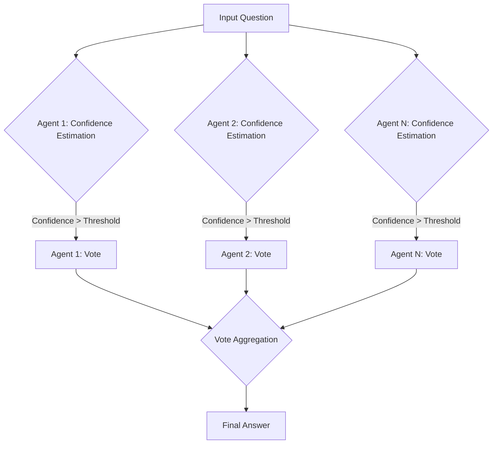

# 📄 Paper Digest: 2026-02-27

## Epistemic Filtering and Collective Hallucination: A Jury Theorem for Confidence-Calibrated Agents

| 項目 | 詳細 |
|------|------|
| **著者** | Jonas Karge |
| **発表日** | 2026-02-27T00:00:00-05:00 |
| **分野** | AI |
| **arXiv** | [リンク](https://arxiv.org/abs/2602.22413) |
| **PDF** | [リンク](https://arxiv.org/pdf/2602.22413) |

---

### 🎓 前提知識

*   **Condorcet Jury Theorem (CJT)**：多数決で正しい判断が下される確率を高めるための理論。各人がランダムに判断するよりも、集団で判断した方が賢明であるという考え方だ。**現実世界のたとえ：** クイズ番組で答えが分からなくても、観客に聞けば正解率が上がる、あれと同じ原理。ただし、観客全員が適当に答えているわけではないことが前提。

*   **Calibration（キャリブレーション）**：AIモデルが自身の予測に対する信頼度を正確に反映するように調整するプロセス。自信があるときは高い確率を、自信がないときは低い確率を出力するようにする。**現実世界のたとえ：** 天気予報で「降水確率90%」と言われたら傘を持っていくように、予報の精度が高いほど、我々は行動を適切に変えられる。AIも同様に、自信の度合いが正確であれば、より安全に利用できる。

*   **Hallucination（ハルシネーション、幻覚）**：大規模言語モデル（LLM）が、事実に基づかない、もっとひどい場合は意味不明な内容を生成すること。LLMは流暢な文章を生成できるが、必ずしも真実を語るとは限らない。**現実世界のたとえ：** ChatGPTに「〇〇という本の要約をしてください」と聞いたとき、存在しない本の内容をでっち上げて説明する、あれがハルシネーション。もっともらしい嘘をつくのがタチが悪い。

### 📖 この研究が解こうとしている問題

大規模言語モデル（LLM）の普及に伴い、AIによる集団意思決定の重要性が増している。複数のAIエージェントに同じ問題を解かせ、その結果を統合することで、より正確な判断が期待できるからだ。しかし、LLMはハルシネーションを起こしやすく、自信満々に嘘をつくことがある。また、全てのAIエージェントが常に参加するとは限らない。専門知識を持つエージェントだけが判断に参加する方が、全体の精度が向上する可能性もある。既存のCondorcet Jury Theorem (CJT)は、エージェントの能力が固定で、常に投票に参加することを前提としているため、現実的なAIシステムに適用するには限界がある。つまり、「自信がないなら黙っててくれ！」という状況を考慮した、より柔軟な集団意思決定の理論が必要なのだ。

### 🔬 手法・アプローチ

一言でいえば、**個々のAIエージェントが自分の得意分野を学習し、自信がある時だけ投票に参加することで、集団としての判断精度を向上させるアプローチである。**

まず、AIエージェントは「キャリブレーション」という段階を経て、自分の能力を自己評価する。過去の経験から、どの問題が得意で、どの問題が苦手かを学習し、自信の度合いを数値化するのだ。次に、各エージェントは、問題に答える際に、自分の自信に基づいて投票するかどうかを判断する。自信が一定の閾値を超えた場合のみ投票に参加し、自信がない場合は棄権する。論文では、この仕組みを数理的にモデル化し、集団全体の正答率が、従来のCJTよりも向上することを理論的に証明している。また、モンテカルロシミュレーションによって、理論的な予測が実際に起こることを確認している。

**トレードオフ：** 個々のエージェントが棄権する可能性があるため、常に十分な数の投票が集まるとは限らない。特に、難しい問題では、自信のあるエージェントが少なくなり、集団としての判断が難しくなる可能性がある。しかし、自信のないエージェントが誤った情報を持ち込むリスクを減らすことで、全体的な精度向上を狙っている。つまり、**「全員参加」よりも「賢い人だけ参加」の方が、長期的には良い結果をもたらす、という思想に基づいたアプローチ**だといえる。

### 🏗️ アーキテクチャ図

この図は、複数のエージェントが質問に答える際に、自信度に基づいて投票するかどうかを決定し、その結果を集約して最終的な回答を導き出すプロセスを示しています。各エージェントは自信度を評価し、閾値を超えた場合のみ投票に参加します。

### 💡 主要な貢献
*   **選択的参加による集団精度向上を理論的に保証** — エージェントが自身の信頼度に基づいて投票を棄権することで、Condorcet Jury Theoremの漸近的な保証を、逐次的かつ信頼度に基づいた設定に一般化しました。
*   **グループの成功確率に対する非漸近的な下限を導出** — 実用的なシナリオにおいて、グループ全体の意思決定の信頼性を評価するための具体的な指標を提供します。
*   **LLMのハルシネーション軽減への応用可能性を示唆** — AIセーフティの分野への応用を示唆し、特に集団LLMの意思決定におけるハルシネーションを軽減するための新たなアプローチを提示しました。

### 🌍 実務への応用可能性
この研究の成果は、複数のAIエージェントを利用するシステムにおいて、全体の精度と信頼性を向上させるために応用できます。例えば、複数のLLMに同じタスクを実行させ、それぞれの自信度に基づいて回答を重み付けしたり、信頼度の低い回答を無視したりすることで、より正確な結果を得ることが可能です。既存のアンサンブル学習のフレームワークに組み込むこともできます。プロジェクトに取り入れる第一歩としては、まず個々のモデルの出力に対する信頼度スコアを適切にキャリブレーションすることから始めるのが良いでしょう。そして、その信頼度スコアを基に、モデルの選択的利用や、結果の重み付けを実装することで、よりロバストなシステムを構築できる可能性があります。この手法は、特に安全性や信頼性が重要なアプリケーション（医療診断、金融取引など）において有効と考えられます。

### 📚 関連キーワード
*   **Ensemble Learning:** 複数のモデルを組み合わせて、単一のモデルよりも高い予測精度を得るための機械学習手法。
*   **Model Calibration:** モデルが出力する確率が、実際の精度を反映するように調整するプロセス。
*   **AI Safety:** AIシステムの潜在的なリスクを軽減し、人間の価値観に合致するように開発するための研究分野。
*   **Selective Classification:** モデルが予測を拒否するオプションを持つ分類手法。
*   **Multi-Agent Systems:** 複数の自律的なエージェントが相互作用し、協調して問題を解決するシステム。
*   **Confidence Intervals:** 推定値の信頼性を示す統計的な範囲。
*   **Bayesian Methods:** 確率的な推論と意思決定を行うための統計的なアプローチ。

---
Auto-generated by Paper Digest workflow. Category: AI