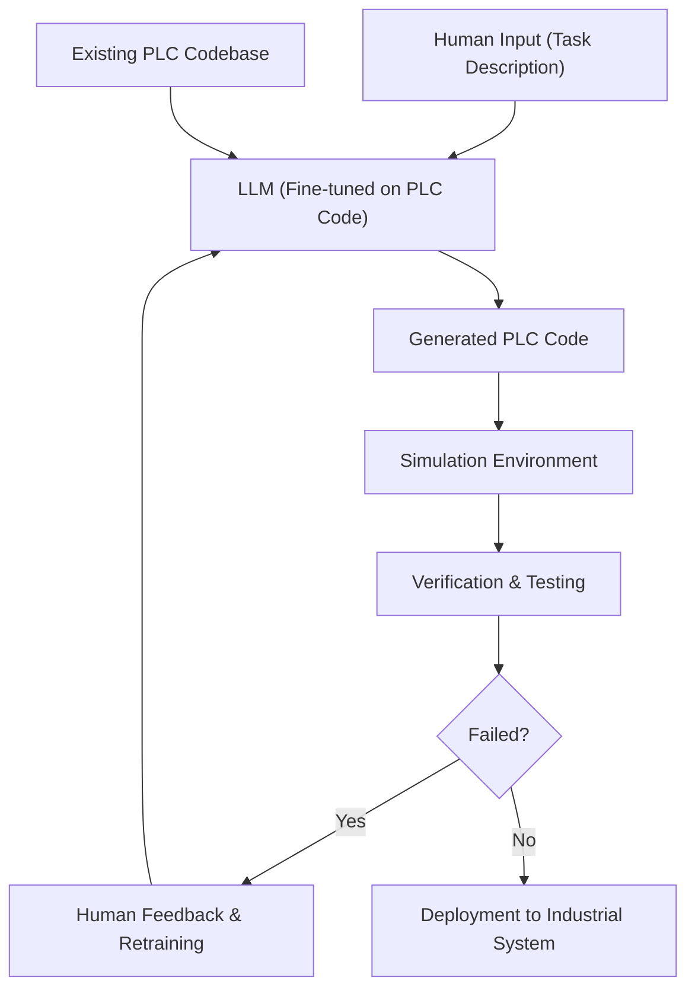

# 📄 Paper Digest: 2026-02-28

## Utilizing LLMs for Industrial Process Automation

| 項目 | 詳細 |
|------|------|
| **著者** | Salim Fares |
| **発表日** | 2026-02-26T18:38:00Z |
| **分野** | クラウド |
| **arXiv** | [リンク](https://arxiv.org/abs/2602.23331v1) |
| **PDF** | [リンク](https://arxiv.org/pdf/2602.23331v1) |

---

### 🎓 前提知識

1.  **LLM（大規模言語モデル）**: これは、大量のテキストデータを学習し、人間のようなテキストを生成したり、質問に答えたりできるAIモデルのこと。例えば、あなたが普段使っている検索エンジンの裏側で動いていたり、文章作成AIアシスタントとして活躍している。「AIチャットボット」と聞けばイメージしやすいだろう。

2.  **PLC（プログラマブルロジックコントローラ）**: 工場の機械やロボットを制御するために使われる、産業用コンピュータのこと。工場にあるベルトコンベアの速度を調整したり、ロボットアームの動きを制御したりする、縁の下の力持ちだ。PLCは、専用のプログラミング言語（ラダー図など）で記述されることが多い。これは、自動車工場の生産ライン全体を指揮する司令塔のようなもの。

3.  **産業プロセス自動化**: 工場などの生産プロセスを、人の手を介さずに自動で行うこと。例えば、食品工場で材料の投入から包装までを自動で行ったり、化学プラントで温度や圧力を自動で調整したりする。まるで、レゴブロックで複雑な動きをするロボットを組み立て、プログラムで制御するようなもの。

### 📖 この研究が解こうとしている問題

近年、ソフトウェア開発にLLMを活用する研究が盛んだ。しかし、その多くはPythonのような汎用的なプログラミング言語に焦点を当てている。なぜなら、LLMを学習させるためのデータが豊富に存在するからだ。ところが、産業プロセス自動化の分野で使用されるPLCのプログラミング言語は、非常に特殊で、限られた企業内でしか使われていないことが多い。そのため、LLMを活用したくても、学習データが不足しており、なかなか実用化が進んでいないのが現状だ。もしLLMがPLCのプログラミングを支援できるようになれば、ロボットアームの制御ルーチンを自動生成したり、製造システムの開発サイクルを大幅に短縮したりできる可能性がある。著者は、この「ニッチだけど重要な課題」に目をつけたのだ。

### 🔬 手法・アプローチ

一言でいえば、**LLMを産業プロセス自動化に適用し、PLCプログラミングの効率化を目指すアプローチ**だ。著者は、特定の産業タスク（ロボットアームの動作ルーチン生成など）に焦点を当て、LLMがPLCのコードを生成できるか検証する。まず、既存のPLCコードをLLMに学習させ、特定のタスクに対するコード生成能力を向上させる。次に、生成されたコードをシミュレーション環境でテストし、実際の産業環境での動作を検証する。この時、専門家がコードの品質を評価し、LLMの改善にフィードバックする仕組みも導入する。これにより、LLMはPLCプログラミングの知識を獲得し、より複雑なタスクに対応できるようになるはずだ。

ただし、このアプローチにはトレードオフもある。LLMは学習データに大きく依存するため、特定のPLC言語や産業タスクに特化した学習データが十分にないと、期待通りの性能を発揮できない可能性がある。また、生成されたコードの安全性や信頼性を保証するためには、厳格な検証プロセスが不可欠だ。つまり、開発速度は向上するかもしれないが、その分、検証コストが増加する可能性があるのだ。

### 🏗️ アーキテクチャ図

この図は、LLMを用いたPLCコード生成のプロセスを示しています。人間が記述したタスクに基づいてLLMがPLCコードを生成し、シミュレーション環境で検証、必要に応じて人間によるフィードバックをLLMに反映するサイクルを表しています。既存のPLCコードベースもLLMの学習データとして利用されます。

### 💡 主要な貢献

*   **産業用言語へのLLM適用可能性を示唆** — PLCのような特殊なドメイン固有言語(DSL)においても、適切なファインチューニングでLLMが実用的なコードを生成できる可能性を示唆した。
*   **開発サイクル短縮の可能性** — ロボットアームの動作ルーチンなどのタスクにおいて、手動プログラミングに比べてLLMによる自動生成が開発時間とコストを削減できる可能性を示唆した。
*   **PLCコードのシミュレーションとテストの重要性を強調** — LLMが生成したコードの信頼性と安全性を確保するために、シミュレーション環境での徹底的な検証が不可欠であることを明確にした。
*   **人間とLLMの協調ワークフローの有効性** — 人間によるフィードバックとLLMの継続的な再学習を組み合わせることで、コード品質を段階的に向上させるアプローチを提案した。

### 🌍 実務への応用可能性

この研究成果は、製造業における産業用ロボットの制御プログラム開発の効率化に大きく貢献する可能性があります。具体的には、PLCのプログラミングをLLMに支援させることで、これまで専門の技術者が時間をかけて行っていた作業を迅速化できます。既存のPLC開発環境に、LLMを活用したコード自動生成機能を組み込むことで、プログラマの生産性を向上させることが期待できます。また、新しい製造ラインの立ち上げや、既存設備の機能拡張時に、迅速なプログラミングが可能になります。自社のPLCプログラミングの標準化とデータセット構築から始め、小規模なタスクからLLMによる自動生成を試すのが良いでしょう。生成されたコードの安全性検証は特に重要です。

### 📚 関連キーワード

*   **Programmable Logic Controller (PLC)** — 工場などの自動化システムを制御するための専用コンピュータ。
*   **Domain-Specific Language (DSL)** — 特定のドメイン（分野）に特化したプログラミング言語。PLCのラダー図などが該当する。
*   **Transfer Learning** — あるタスクで学習した知識を別のタスクに応用する機械学習の手法。LLMのファインチューニングで活用される。
*   **Robotics Operating System (ROS)** — ロボットアプリケーション開発のためのオープンソースのフレームワーク。シミュレーション環境との連携に利用できる。
*   **Digital Twin** — 現実世界の物理システムをデジタル空間で再現したモデル。PLCコードのシミュレーション環境として活用される。
*   **IEC 61131-3** — PLCのプログラミング言語に関する国際規格。標準化されたPLCコード生成に役立つ。
*   **Continuous Integration/Continuous Delivery (CI/CD)** — ソフトウェア開発における自動化されたプロセス。LLMが生成したコードのテストとデプロイを効率化する。
*   **Edge Computing** — データ処理をクラウドではなく、デバイスに近い場所で行う技術。PLCとLLMを連携させる際の選択肢となる。

---
Auto-generated by Paper Digest workflow. Category: クラウド