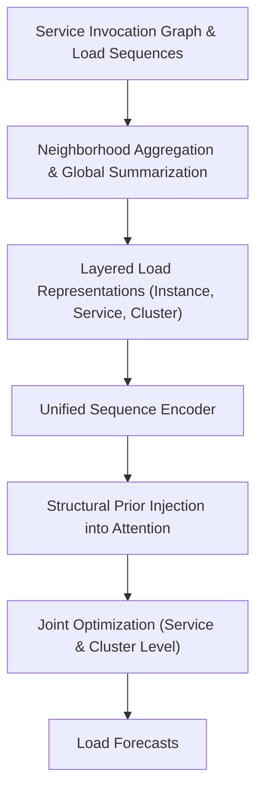

# 📄 Paper Digest: 2026-03-01

## An Artificial Intelligence Framework for Joint Structural-Temporal Load Forecasting in Cloud Native Platforms

| 項目 | 詳細 |
|------|------|
| **著者** | Qingyuan Zhang |
| **発表日** | 2026-02-26T09:15:59Z |
| **分野** | 大規模分散処理 |
| **arXiv** | [リンク](https://arxiv.org/abs/2602.22780v1) |
| **PDF** | [リンク](https://arxiv.org/pdf/2602.22780v1) |

---

### 🎓 前提知識

*   **マイクロサービス:** アプリケーション全体を、独立してデプロイ可能な小さなサービス群に分割するアーキテクチャ。各サービスは特定のビジネスロジックを担当する。**現実世界のたとえ:** 大規模な工場を、各工程を担当する小さな専門工場に分割するイメージ。これにより、一部の工程の変更が他の工程に影響を与えにくくなる。
*   **サービスインボケーショングラフ:** マイクロサービス間の呼び出し関係をグラフ構造で表現したもの。各ノードがサービス、エッジが呼び出しを示す。**現実世界のたとえ:** 企業の組織図のようなもの。誰が誰に指示を出すか、情報の流れが一目でわかる。
*   **ロード予測:** システムにかかる負荷を予測すること。CPU使用率、メモリ使用量、リクエスト数など、様々な指標が用いられる。**現実世界のたとえ:** 天気予報のようなもの。過去のデータや現在の状況から、未来の状態を予測する。ロード予測が正確であれば、リソースの過不足を防ぎ、システムの安定稼働に繋がる。

### 📖 この研究が解こうとしている問題

クラウドネイティブな環境、特にマイクロサービスアーキテクチャでは、負荷予測が非常に難しい問題となる。なぜなら、サービス間の呼び出し関係が複雑に入り組み、あるサービスの負荷変動が、連鎖的に他のサービスに影響を与えるからだ。さらに、個々のサービスにかかる負荷は、時間帯やイベントによって大きく変動する。既存の負荷予測手法は、多くの場合、個々のサービスを独立して扱うため、サービス間の依存関係や負荷の伝播を考慮できない。その結果、予測精度が低くなり、リソースの無駄遣いやパフォーマンス低下を引き起こしてしまう。つまり、マイクロサービス間の複雑な依存関係と、時間的に変動する負荷を同時に考慮した、より高度な負荷予測手法が求められているのだ。

### 🔬 手法・アプローチ

一言でいえば、 **サービス間の呼び出し構造と時間的な負荷変動を統合的に学習する、新しいAIフレームワーク**だ。

このフレームワークは、まずマイクロサービスシステムを「時間とともに変化するサービス呼び出しグラフ」と「複数の負荷時系列データ」の組み合わせとして表現する。次に、サービスレベルの観測に基づき、近隣サービスを集約したビューと、システム全体を要約したグローバルビューを構築する。これにより、インスタンス、サービス、クラスタという階層的な負荷表現を実現している。そして、この階層構造と時系列データを、統一されたシーケンスエンコーダに通し、過去のコンテキストを学習する。さらに、サービス間の依存関係を捉えるために、注意機構（Attention）の計算に、軽量な構造事前知識を導入する。これにより、呼び出しチェーンに沿った負荷の伝播と蓄積をより効果的に捉えつつ、ローカルな負荷の急増や全体的なトレンドも同時にモデル化することを可能にした。最後に、サービスレベルとクラスタレベルの両方の予測を同時に最適化する、多目的回帰戦略を採用することで、予測の安定性を向上させている。

**トレードオフ:** このアプローチにより、マイクロサービス間の依存関係を考慮した高精度な負荷予測が可能になる。しかし、モデルの複雑さが増すため、学習に要する計算コストや、モデルの解釈性が低下する可能性がある。また、構造事前知識の導入は、システムの構成変更への対応を難しくする可能性も考えられる。

### 🏗️ アーキテクチャ図

この図は、提案フレームワークの主要な処理の流れを示しています。サービス呼び出しグラフと負荷時系列データが入力され、階層的な負荷表現を経て、構造事前知識を注入したAttention機構で学習され、最終的に負荷予測が出力されます。

### 💡 主要な貢献
*   **高精度な負荷予測を実現** — サービス間の依存関係と時間的な負荷変動を統合的に学習することで、従来手法よりも予測精度が向上。
*   **マイクロサービスアーキテクチャに特化した設計** — サービス呼び出しグラフと負荷時系列データを組み合わせた表現により、マイクロサービス間の複雑な関係性を捉えることが可能。
*   **階層的な負荷表現** — インスタンス、サービス、クラスタという多層的な視点を取り入れることで、様々な粒度での負荷予測に対応。
*   **構造事前知識のAttention機構への導入** — サービス間の依存関係をより効果的に捉え、負荷の伝播と蓄積を正確にモデル化。
*   **多目的最適化による予測安定性の向上** — サービスレベルとクラスタレベルの予測を同時に最適化することで、予測のロバスト性を高める。

### 🌍 実務への応用可能性
この研究の成果は、クラウドネイティブ環境におけるキャパシティプランニング、リソースオーケストレーション、ランタイム状況把握に大きく貢献します。例えば、Kubernetes環境において、Horizontal Pod Autoscaler (HPA) の性能を向上させ、リソースの無駄遣いを減らすことができます。また、サービスメッシュ環境では、Envoyなどのプロキシのルーティングを最適化し、レイテンシを削減することができます。既存のモニタリングツール（Prometheus, Grafanaなど）と組み合わせることで、より高度な異常検知や根本原因分析が可能になります。プロジェクトに取り入れるには、まず既存システムのサービス呼び出しグラフを可視化し、負荷時系列データを収集・分析することから始めるのが良いでしょう。次に、このフレームワークを参考に、自社のシステムに合わせたモデルを構築し、学習させることで、より正確な負荷予測を実現できます。

### 📚 関連キーワード
*   **Cloud Native:** コンテナ、サービスメッシュ、マイクロサービス、イミュータブルインフラストラクチャ、宣言型APIといった要素を用いて、スケーラブルなアプリケーションを構築・実行するためのアプローチ。
*   **Microservices:** アプリケーションを独立した、疎結合なサービスの集合として構築するアーキテクチャスタイル。
*   **Service Mesh:** マイクロサービス間の通信を管理・制御するためのインフラ層。トラフィック管理、セキュリティ、可観測性などを提供。
*   **Kubernetes:** コンテナ化されたアプリケーションのデプロイ、スケーリング、管理を自動化するためのプラットフォーム。
*   **Horizontal Pod Autoscaler (HPA):** Kubernetesにおける、CPU使用率などのメトリクスに基づいてPodのレプリカ数を自動的に調整する機能。
*   **Prometheus:** 時系列データを収集・保存するためのオープンソースのモニタリングシステム。
*   **Grafana:** Prometheusなどのデータソースからデータを可視化するためのオープンソースダッシュボードツール。
*   **Attention Mechanism:** ニューラルネットワークにおいて、入力シーケンスのどの部分に注目するかを学習する機構。翻訳や画像認識など、様々なタスクで利用されている。

---
Auto-generated by Paper Digest workflow. Category: 大規模分散処理