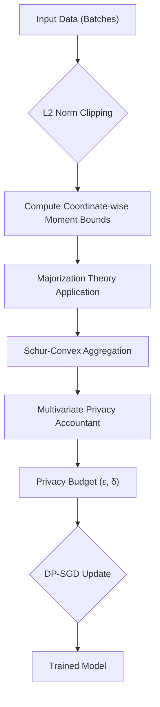

# 📄 Paper Digest: 2026-03-02

## Lap2: Revisiting Laplace DP-SGD for High Dimensions via Majorization Theory

| 項目 | 詳細 |
|------|------|
| **著者** | Meisam Mohammady, Qin Yang, Nicholas Stout, Ayesha Samreen, Han Wang 他2名 |
| **発表日** | 2026-03-02T00:00:00-05:00 |
| **分野** | セキュリティ |
| **arXiv** | [リンク](https://arxiv.org/abs/2602.23516) |
| **PDF** | [リンク](https://arxiv.org/pdf/2602.23516) |

---

### 🎓 前提知識

1.  **差分プライバシー (Differential Privacy; DP)**：個人のデータを保護しつつ、データセット全体の傾向を分析するためのフレームワーク。DPを実現するには、クエリの結果にノイズを加える。
    **現実世界のたとえ:** 映画のレビューサイトで、個人のレビューを特定されないように、評価にランダムな星の数を追加するようなもの。全体の評価分布は変わらないが、個人の意見は曖昧になる。

2.  **確率的勾配降下法 (Stochastic Gradient Descent; SGD)**：機械学習モデルを訓練するための最適化アルゴリズム。データセット全体ではなく、ランダムに抽出された一部のデータ（ミニバッチ）を使って、モデルのパラメータを少しずつ調整する。
    **現実世界のたとえ:** 大きな山を、全体像を見ずに、足元の傾斜だけを見て少しずつ下っていくようなもの。

3.  **L1ノルムとL2ノルム**: ベクトルの「長さ」を測るための指標。L1ノルムは各要素の絶対値の合計、L2ノルムは各要素の二乗和の平方根。
    **現実世界のたとえ:** L1ノルムは、地図アプリで行きたい場所までの方角転換の回数（各方向への移動距離）、L2ノルムは目的地までの直線距離のようなもの。高次元空間では、L1ノルムはL2ノルムよりも大きくなりやすい。

### 📖 この研究が解こうとしている問題

深層学習モデルを訓練する際、プライバシー保護のためにDP-SGDがよく用いられる。DP-SGDは、学習時に勾配にノイズを加えることで、個人のデータがモデルに与える影響を隠蔽する。一般的にノイズを加える方式としてガウス分布に従うノイズを加える方式が用いられるが、ラプラス分布に従うノイズを加える方式も存在する。ラプラス分布のノイズを用いる方式は、L1ノルムのクリッピングに依存しているため、高次元モデルでは次元数が増えるほどノイズが大きくなってしまう。これは、高次元空間ではL1ノルムがL2ノルムよりも大きくなりやすいためだ。結果として、モデルの精度が著しく低下したり、学習自体が困難になったりするという問題があった。つまり、従来のラプラスDP-SGDは、大規模なモデルや高次元データに対して実用的ではなかったのだ。この論文では、高次元モデルでもラプラスDP-SGDを効果的に利用できるようにすることを目指している。

### 🔬 手法・アプローチ

一言でいえば、**L2ノルムクリッピングを適用したラプラスDP-SGDを高次元データに適用するために、Moment Accountantを改善するアプローチ**である。

この論文の核心は、L2ノルムクリッピングを使いつつ、ラプラスメカニズムの利点を活かすために、Majorization理論を適用してプライバシー損失をより厳密に評価すること。具体的には、まず、各座標軸方向のモーメントの境界を計算する。次に、Majorization理論を用いて、モデル全体の厳密なデータに依存しない上限を構築する。これにより、モデルの次元数が増加しても、プライバシー損失の増加を抑えることができる。さらに、Schur-convexityという性質を利用して、モーメントの集約方法を工夫し、多数のモーメントを効率的に利用できるようにした。この手法により、高次元モデルでもラプラスDP-SGDの性能を大幅に向上させ、強いプライバシー制約下でもガウスDP-SGDと同等かそれ以上の精度を実現できる。

**トレードオフ**として、Majorization理論に基づく複雑な計算が必要になるため、計算コストが増加する可能性がある。しかし、高次元データにおける精度向上と、ラプラスメカニズムの潜在的な利点（例えば、特定の状況下でのプライバシー保護性能の高さ）を考慮すると、この計算コストは十分にペイすると言えるだろう。

### 🏗️ アーキテクチャ図

この図は、Lap2の主要なステップを示しています。入力データから始まり、L2ノルムクリッピング、モーメント境界の計算、Majorization理論の適用を経て、プライバシー会計を行い、DP-SGDでモデルを更新します。最終的に、プライバシー保護された学習済みモデルが得られます。

### 💡 主要な貢献

*   **高次元ラプラスDP-SGDの精度を大幅に向上** — L2ノルムクリッピングとMajorization理論を組み合わせることで、次元の呪いを軽減し、高次元モデルでも効果的なプライバシー保護学習を実現した。
*   **ガウスDP-SGDに匹敵する性能を実現** — 強いプライバシー制約下（低いε値）において、RoBERTaなどの大規模モデルで、Lap2がガウスDP-SGDと同等またはそれ以上の精度を達成できることを示した。
*   **新しいプライバシー会計手法の導入** — 座標ごとのモーメント境界とSchur-convexityを利用したモーメント集約により、よりタイトなプライバシー損失の評価を可能にした。
*   **実用的なラプラスDP-SGDの実現** — 従来手法の課題であったL1ノルムクリッピングの制約を克服し、より一般的なL2ノルムクリッピングを適用可能にしたことで、実用的なラプラスDP-SGDへの道を開いた。

### 🌍 実務への応用可能性

Lap2の成果は、特に大規模言語モデルや推薦システムなど、高次元の特徴量を持つデータセットでプライバシー保護が重要な場合に有効です。例えば、医療データや金融データなど、機密性の高い情報を扱う分野での活用が期待できます。既存のDP-SGDの実装をLap2の考え方に基づいて改良することで、より高い精度とプライバシー保護の両立が可能になります。具体的には、TensorFlow PrivacyやPyTorchのOpacusといったフレームワークに組み込むことが考えられます。プロジェクトへの導入にあたっては、まずLap2の理論的な背景を理解し、既存のDP-SGD実装におけるモーメント会計部分を、論文で提案されている手法に置き換えることから始めると良いでしょう。また、Lap2はガウスDP-SGDと比較して、プライバシーパラメータの調整や最適化が異なる可能性があるため、実験を通じて最適な設定を見つけることが重要です。

### 📚 関連キーワード

*   **Differential Privacy (DP)**：個人情報を保護しながらデータ分析を行うためのフレームワーク。
*   **Stochastic Gradient Descent (SGD)**：機械学習モデルを訓練するための最適化アルゴリズム。
*   **Laplace Mechanism**: 差分プライバシーを実現するためのノイズ付加メカニズムの一つで、ラプラス分布に従うノイズを加える。
*   **Gaussian Mechanism**: 差分プライバシーを実現するためのノイズ付加メカニズムの一つで、ガウス分布に従うノイズを加える。
*   **Majorization Theory**: ベクトルの不等式を扱う数学の分野で、プライバシー会計の厳密な評価に利用される。
*   **Moment Accountant**: 差分プライバシーのプライバシー損失を追跡するための手法。
*   **L1/L2 Norm Clipping**: 勾配の大きさを制限することで、個々のデータの寄与を抑え、プライバシーを保護する手法。
*   **Federated Learning**: 分散されたデバイス上でモデルを訓練する機械学習パラダイムで、プライバシー保護の重要性が高い。

---
Auto-generated by Paper Digest workflow. Category: セキュリティ