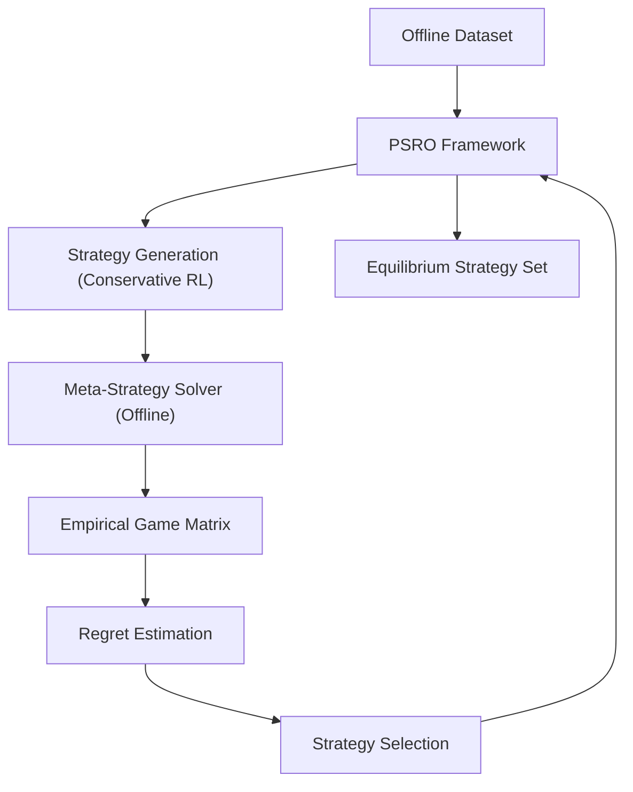

# 📄 Paper Digest: 2026-03-03

## Conservative Equilibrium Discovery in Offline Game-Theoretic Multiagent Reinforcement Learning

| 項目 | 詳細 |
|------|------|
| **著者** | Austin A. Nguyen, Michael P. Wellman |
| **発表日** | 2026-03-03T00:00:00-05:00 |
| **分野** | AI |
| **arXiv** | [リンク](https://arxiv.org/abs/2603.00374) |
| **PDF** | [リンク](https://arxiv.org/pdf/2603.00374) |

---

### 🎓 前提知識

*   **マルチエージェント強化学習**: 複数の自律的なエージェントが、互いに影響を与え合いながら、報酬を最大化するように学習するフレームワークのこと。**現実世界のたとえ：** 複数の自動運転車が、互いの動きを予測しながら、交通渋滞を最小限に抑えるようにルートを選択するようなもの。

*   **オフライン強化学習**: 既存のデータセットから学習する強化学習の手法。新しいデータを収集するための環境とのインタラクションは行わない。**現実世界のたとえ：** 過去の顧客の購買履歴データから、新しいレコメンドエンジンを訓練するようなもの。実際に新しい商品を勧めて反応を見ることはしない。

*   **ゲーム理論における均衡**: 複数のプレイヤーがいるゲームにおいて、どのプレイヤーも戦略を変更するインセンティブを持たない状態のこと。**現実世界のたとえ：** じゃんけんで、全員がランダムに手を出す状態。特定の人がグーばかり出す、などの偏りがない状態が均衡だ。

### 📖 この研究が解こうとしている問題

複数のAIエージェントが互いに影響し合う環境（例えば、オークションや自動運転）で、各エージェントが最適な戦略を学習する問題は非常に難しい。特に、実世界のデータは限られているため、オフライン強化学習で戦略を学習したいというニーズがある。しかし、オフライン学習では、AIエージェントが経験できない行動や状況が多数存在するため、学習した戦略が本当に最適な「均衡」になっているか検証することが困難だ。既存のオフライン強化学習手法では、データの偏りや不確実性によって、実際には低い成果しか得られない戦略を「最適」と誤ってしまうリスクがある。この論文では、限られたデータから、より信頼性の高い均衡戦略を発見するための新しいアプローチを提案している。

### 🔬 手法・アプローチ

一言でいえば、**限られたオフラインデータの中で、真のゲームにおける後悔（regret）が低い均衡戦略を見つけるために、Policy Space Response Oracles (PSRO)を保守的なオフライン強化学習の原則と組み合わせた手法**だ。

このアプローチ（COffeE-PSRO）の核心は、ゲームのダイナミクスに関する不確実性を考慮し、強化学習の目的関数を調整することで、真のゲームで低い後悔を持つ可能性が高い戦略に重点を置く点にある。具体的には、まず既存のオフラインデータを用いて、複数の候補となる均衡戦略を生成する。次に、これらの戦略が実際に均衡であるかどうかを完全に検証するのではなく、データから得られる情報に基づいて、各戦略が「真のゲーム」において低い後悔をもたらす確率を推定する。そして、この確率を考慮して、より保守的な戦略探索を行うことで、データに過度に適合した、実際には使い物にならない戦略を選択してしまうリスクを軽減する。さらに、オフライン設定に特化した新しいメタ戦略ソルバーを提案し、PSROにおける戦略探索を効率化している。

**トレードオフ**としては、データに対する適合性を保守的にすることで、真に最適な戦略を見逃す可能性も考えられる。しかし、限られたデータしか利用できない状況においては、過度に楽観的な戦略を選択するよりも、現実的な範囲で最適な戦略を見つける方が、全体的なパフォーマンス向上に繋がると考えられる。

### 🏗️ アーキテクチャ図

この図は、COffeE-PSROの処理フローを示しています。オフラインデータセットからPSROフレームワークが戦略を生成し、オフラインデータに特化したメタ戦略ソルバーを経て、経験的なゲーム行列を作成します。そして、後悔推定に基づいて戦略が選択され、最終的に均衡戦略のセットが得られます。

### 💡 主要な貢献
*   **オフラインゲームソルビングへの保守的強化学習の導入** — 既存のオフライン強化学習の原則をゲーム理論的なマルチエージェント環境に適用し、データ不足による不確実性に対処する新しいフレームワークを提案した。
*   **COffeE-PSROアルゴリズムの開発** — Policy Space Response Oracles (PSRO)を拡張し、ゲームダイナミクスの不確実性を定量化し、真のゲームで低い後悔を持つ可能性が高い戦略に重点を置くように強化学習の目的関数を修正した。
*   **オフライン設定に特化したメタ戦略ソルバーの提案** — PSROにおける戦略探索を効率化するために、既存のオンラインメタ戦略ソルバーをオフライン設定に適応させた新しいソルバーを開発した。
*   **実証的な有効性の検証** — 実験を通じて、COffeE-PSROが最先端のオフラインアプローチよりも低い後悔の解を抽出できることを示した。

### 🌍 実務への応用可能性
COffeE-PSROの成果は、限られたデータから最適な戦略を学習する必要がある様々な実務的な場面で応用可能です。例えば、過去の取引データから最適な価格設定戦略を学習する、あるいは、医療データから最適な治療計画を学習するといったケースが考えられます。この手法は、特にデータ収集が困難またはコストがかかる状況で有効です。既存の強化学習フレームワーク（例：TensorFlow Agents、RLlib）に組み込むことで、オフラインデータを用いた戦略学習機能を拡張できます。読者が自分のプロジェクトに取り入れるには、まず既存のオフラインデータセットを準備し、COffeE-PSROアルゴリズムを実装（または既存の実装を調査）して、具体的な問題設定に合わせて調整することから始めると良いでしょう。

### 📚 関連キーワード
*   **Offline Reinforcement Learning** — 環境とのインタラクションなしに、既存のデータセットから学習する強化学習の手法。
*   **Multi-Agent Reinforcement Learning (MARL)** — 複数のエージェントが相互作用しながら学習する強化学習。
*   **Game Theory** — 複数のプレイヤーの意思決定を分析する数学的なフレームワーク。
*   **Nash Equilibrium** — ゲーム理論における解概念で、どのプレイヤーも自分の戦略を変更するインセンティブを持たない状態。
*   **Policy Space Response Oracles (PSRO)** — ゲームソルビングのための反復的なアルゴリズムで、戦略空間を探索し、最適な戦略を学習する。
*   **Conservative Policy Optimization** — オフライン強化学習における手法の一つで、学習されたポリシーが既存のデータから大きく逸脱しないように制約する。
*   **Meta-Strategy Solver** — 複数の戦略を組み合わせることで、より良い戦略を生成する手法。

---
Auto-generated by Paper Digest workflow. Category: AI