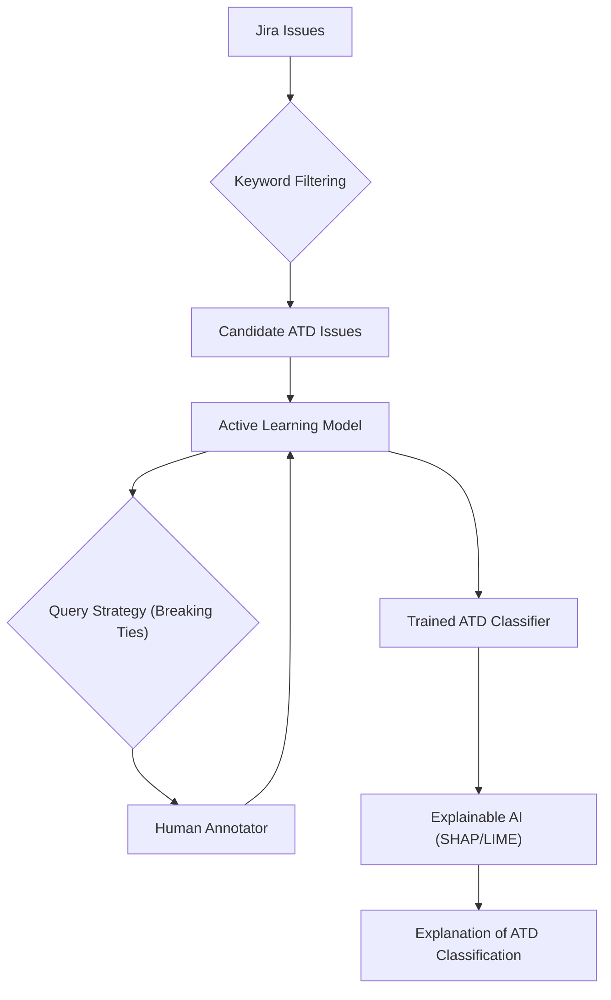

# 📄 Paper Digest: 2026-03-04

## Reducing Labeling Effort in Architecture Technical Debt Detection through Active Learning and Explainable AI

| 項目 | 詳細 |
|------|------|
| **著者** | Edi Sutoyo, Paris Avgeriou, Andrea Capiluppi |
| **発表日** | 2026-03-04T00:00:00-05:00 |
| **分野** | クラウド |
| **arXiv** | [リンク](https://arxiv.org/abs/2603.02944) |
| **PDF** | [リンク](https://arxiv.org/pdf/2603.02944) |

---

### 🎓 前提知識

1.  **技術的負債 (Technical Debt):** ソフトウェア開発において、将来的な問題を承知の上で意図的に行う設計上の妥協のこと。例えば、締め切りに間に合わせるために、本来はもっと綺麗に書けるコードを一旦「動けばOK」として実装することが技術的負債にあたる。**現実世界のたとえ：** 引っ越しの際、とりあえず段ボールを積み上げて部屋の隅に置いておくようなもの。一時的には楽だが、後で整理する手間が増える。

2.  **アクティブラーニング (Active Learning):** 機械学習の一種で、モデルが最も学習に役立つデータを選んで人にラベル付けを依頼する手法。全部のデータにラベル付けする代わりに、賢くデータを選んで効率的に学習させる。**現実世界のたとえ：** 試験勉強で、先生に「どこが一番出るか？」を聞いて、そこだけ重点的に勉強するようなもの。

3.  **説明可能なAI (Explainable AI, XAI):** AIの判断根拠を人間が理解できるようにする技術。AIが「なぜそう判断したのか？」を説明することで、AIの透明性と信頼性を高める。**現実世界のたとえ：** 医者が「なぜこの薬を処方したのか？」を患者にわかりやすく説明するようなもの。患者は安心して薬を飲める。

### 📖 この研究が解こうとしている問題

大規模なソフトウェアシステムでは、開発者が「これは後で直すべきだ」と認識している設計上の問題（アーキテクチャ技術的負債、ATD）が蓄積していく。ATDの存在は、コードコメントや課題管理システム（Jiraなど）に自然言語で記録されることが多い。しかし、ATDの検出は非常に手間がかかる。なぜなら、アーキテクチャに関する問題は抽象的で、文脈によって解釈が変わるからだ。従来は、専門家が大量のテキストデータを読み込み、ATDに該当するものを一つ一つ手作業でラベル付けしていた。これはコストがかさみ、時間がかかるだけでなく、専門家の負担も大きい。そこで、ATD検出を自動化したいというニーズがある。しかし、機械学習モデルを学習させるためには、大量のラベル付きデータが必要になるというジレンマがあった。

### 🔬 手法・アプローチ

この研究は、**アクティブラーニングと説明可能なAI (XAI) を組み合わせることで、ATD検出に必要なラベル付け作業を大幅に削減する**アプローチをとる。

まず、ATDに関するJira課題の既存データセットを洗練し、ATDを代表するキーワードを抽出する。このキーワードを使って、大量のJira課題からATDの可能性が高いものを自動的に絞り込む。次に、アクティブラーニングを使って、モデルが最も学習に役立つ課題を選び、専門家はその課題にのみラベル付けを行う。特に「Breaking Ties」という戦略が有効で、モデルが判断に迷う事例を優先的にラベル付けすることで、効率的にモデルの性能を向上させる。さらに、SHAPやLIMEといったXAI技術を用いて、モデルがATDと判断した根拠を人間が理解できるようにする。

**トレードオフ:** このアプローチによって、ラベル付けの労力を約半分に削減しながら、ATD検出の精度をある程度高く保つことができる。しかし、完全に手作業でラベル付けする場合と比較すると、精度は若干低下する可能性がある。また、キーワードによる絞り込みは、キーワードに合致しないATDを見逃すリスクも伴う。XAIによる説明は、モデルの透明性を高めるものの、説明の質はハイライトされる特徴の妥当性に依存する。つまり、AIが示す根拠が常に人間にとって納得できるとは限らない。

### 🏗️ アーキテクチャ図

この図は、提案手法の全体的な流れを示しています。まず、Jiraの課題をキーワードでフィルタリングし、ATDの候補を絞り込みます。次に、アクティブラーニングモデルが最も学習に役立つ課題を選び、人間がラベル付けを行います。学習済みのATD分類器は、SHAPやLIMEなどの説明可能なAIを用いて、分類結果の根拠を提示します。

### 💡 主要な貢献
*   **ATD検出におけるラベル付けの労力を大幅に削減** — キーワードベースのフィルタリングとアクティブラーニングを組み合わせることで、専門家による手動アノテーションの必要性を約49%削減した。
*   **Breaking Ties戦略のアクティブラーニングにおける有効性を示唆** — モデルが判断に迷う事例を優先的にラベル付けすることで、ATD検出のF1スコアを0.72まで向上させた。
*   **XAIによるATD分類の説明可能性を検証** — SHAPとLIMEを用いてATD分類結果を説明することで、モデルの透明性を高め、専門家がAIの判断を理解しやすくした。
*   **ATD検出のためのキーワードリストの作成** - ATD検出に有用なキーワードリストを作成し、他の研究者や実務者がATD検出の初期段階で使用できる基盤を提供した。

### 🌍 実務への応用可能性
この研究の成果は、大規模なソフトウェアプロジェクトにおける技術的負債の管理に役立ちます。Jiraなどの課題管理システムに蓄積された大量の課題から、アーキテクチャに関する技術的負債を自動的に検出することで、開発者は優先的に対応すべき課題を特定し、計画的な改善活動につなげることができます。既存の課題管理システムと連携させ、ATDの疑いがある課題を自動的に特定し、担当者に通知するような仕組みを構築できます。まずは、この研究で用いられたキーワードリストを参考に、自社のプロジェクトに特有のキーワードを追加し、小規模なデータセットで実験的に導入してみるのが良いでしょう。長期的に見ると、技術的負債の早期発見と対応は、ソフトウェアの品質向上と開発効率の改善に大きく貢献します。

### 📚 関連キーワード
*   **Self-Admitted Technical Debt (SATD)**：開発者自身が認識している技術的負債であり、コードコメントやコミットメッセージなどに記述されることが多い。
*   **Architecture Technical Debt (ATD)**：システムアーキテクチャに関する技術的負債であり、検出が難しい。
*   **Active Learning**：機械学習モデルが最も学習に役立つデータを選択的に学習する手法。
*   **Explainable AI (XAI)**：AIの判断根拠を人間が理解できるようにする技術。
*   **SHAP (SHapley Additive exPlanations)**：ゲーム理論に基づいて、個々の特徴量が予測に与える影響度を算出するXAI手法。
*   **LIME (Local Interpretable Model-agnostic Explanations)**：特定のデータ点に対して、モデルの局所的な挙動を説明するXAI手法。
*   **BERT (Bidirectional Encoder Representations from Transformers)**：Transformerアーキテクチャに基づく、自然言語処理の事前学習モデル。ATD検出の精度向上に利用できる。
*   **MLOps (Machine Learning Operations)**：機械学習モデルの開発、デプロイ、運用を効率化するためのDevOpsの考え方。

---
Auto-generated by Paper Digest workflow. Category: クラウド