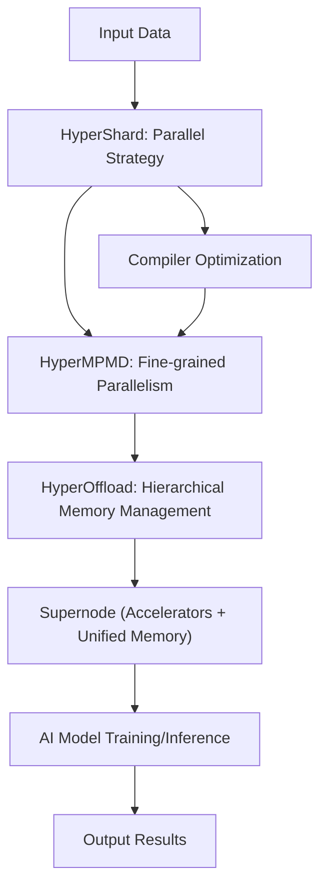

# 📄 Paper Digest: 2026-03-05

## HyperParallel: A Supernode-Affinity AI Framework

| 項目 | 詳細 |
|------|------|
| **著者** | Xin Zhang, Beilei Sun, Teng Su, Qinghua Zhang, Chong Bao 他2名 |
| **発表日** | 2026-03-05T00:00:00-05:00 |
| **分野** | 大規模分散処理 |
| **arXiv** | [リンク](https://arxiv.org/abs/2603.03731) |
| **PDF** | [リンク](https://arxiv.org/pdf/2603.03731) |

---

### 🎓 前提知識

*   **分散学習**: 複数の計算資源（GPU、CPUなど）を使って、一つのAIモデルを学習させること。大規模モデルを扱う上で不可欠な技術だ。まるで、巨大なパズルを複数人で分担して解くようなもので、一人でやるよりも圧倒的に早く完成させられる。
*   **MPMD (Multiple Program, Multiple Data)**: 分散処理の並列化モデルの一種で、各計算ノードが異なるプログラムを実行し、異なるデータを処理する。例えるなら、複数の料理人がそれぞれ異なるレシピを担当し、異なる食材を使ってコース料理を作り上げるようなものだ。柔軟性が高い反面、調整が難しい。
*   **メモリ階層**: 計算機システムにおけるメモリの構造のこと。CPUに近いほど高速だが容量が小さく、遠いほど低速だが大容量になる。これは、高級レストランの厨房で、シェフのすぐそばに置かれた調味料は少量だが使いやすく、倉庫に保管された大量の食材は取り出すのに時間がかかる、という状況に似ている。

### 📖 この研究が解こうとしている問題

近年、AIモデルはますます巨大化・複雑化しており、学習や推論には膨大な計算資源が必要になっている。そこで注目されているのが、多数のアクセラレータ（GPUなど）を高速なネットワークで接続し、大容量のメモリを共有する「スーパーノード」アーキテクチャだ。しかし、既存のAIフレームワークは、このようなスーパーノードの特性を十分に活用できていないのが現状だ。その結果、プログラミングが複雑になり、計算負荷の偏りが発生し、メモリの使用効率も悪くなってしまう。例えば、100人でオーケストラを組んだのに、指揮者が各楽器の特性を理解しておらず、バラバラな演奏になってしまうようなものだ。これではスーパーノードのポテンシャルを最大限に引き出せない。そこで、この論文では、スーパーノードに最適化されたAIフレームワークを提案し、プログラミングの簡素化、負荷分散の改善、メモリ効率の向上を目指している。

### 🔬 手法・アプローチ

この論文は、**スーパーノードを単一の論理的なコンピュータとして扱い、ハードウェアの特性を考慮したオーケストレーション機能をフレームワークに組み込むアプローチ**を提案する。

具体的には、以下の3つの主要な技術要素で構成されている。

1.  **HyperOffload**: 自動階層型メモリ管理機構。メモリ階層を意識せずに、適切な場所にデータを配置し、効率的なメモリ使用を実現する。
2.  **HyperMPMD**: 異質なワークロード間で、きめ細かいMPMD並列処理を行うための機構。各計算ノードの処理能力に合わせて、最適なタスクを割り当てる。
3.  **HyperShard**: 宣言的な並列戦略記述のための機構。プログラマは、高レベルな視点から並列処理戦略を記述でき、フレームワークが自動的に低レベルな実装に変換する。

これらの技術を組み合わせることで、スーパーノードの性能を最大限に引き出し、AIモデルの学習・推論効率を大幅に向上させている。

**トレードオフ**: このアプローチによって、プログラミングの複雑さを軽減し、システムチューニングのオーバーヘッドを削減できる一方、フレームワーク自体が複雑になる可能性がある。また、特定のスーパーノードアーキテクチャに最適化されているため、他の環境への移植が難しいかもしれない。

### 🏗️ アーキテクチャ図

この図は、HyperParallelフレームワークのデータフローを示しています。入力データは、まずHyperShardで並列化戦略が決定され、HyperMPMDで詳細な並列処理が実行されます。HyperOffloadは、スーパーノードのメモリを効率的に管理し、最終的にAIモデルの学習または推論が行われます。コンパイラ最適化は、並列処理を効率化するためにHyperMPMDにフィードバックされます。

### 💡 主要な貢献

*   **スーパーノード向けAIフレームワークの実現** — 多数のアクセラレータと大容量メモリを統合したスーパーノードアーキテクチャを最大限に活用するフレームワークを提案し、大規模AIモデルの学習・推論効率を向上させた。
*   **自動階層型メモリ管理の導入** — HyperOffloadにより、メモリ階層を意識せずに最適なデータ配置を自動化し、メモリ使用効率を大幅に改善した。
*   **きめ細かいMPMD並列処理の実現** — HyperMPMDにより、異質なワークロード間できめ細かいMPMD並列処理を可能にし、計算ノードの処理能力を最大限に引き出した。
*   **宣言的な並列戦略記述の導入** — HyperShardにより、高レベルな視点から並列処理戦略を記述でき、プログラミングの複雑さを軽減し、システムチューニングのオーバーヘッドを削減した。

### 🌍 実務への応用可能性

この研究の成果は、大規模なAIモデルを学習・推論する際に非常に役立ちます。特に、HPC（ハイパフォーマンスコンピューティング）環境や、多数のGPUを搭載したサーバークラスタ上でAIモデルを動作させる場合に有効です。既存のTensorFlow、PyTorchなどのフレームワークと連携させることで、これらのフレームワークのパフォーマンスを向上させることができます。自身のプロジェクトに取り入れるには、まずHyperParallelのアーキテクチャを理解し、既存のAIモデルの並列化戦略をHyperShardで記述することから始めるのが良いでしょう。さらに、HyperOffloadを活用してメモリ管理を最適化することで、より効率的な学習・推論が可能になります。今後は、クラウドベンダーが提供するスーパーノード環境で、HyperParallelのようなフレームワークが標準的に利用されるようになるかもしれません。

### 📚 関連キーワード

*   **スーパーノード**: 多数のGPUや高速インターコネクト、共有メモリプールを持つ、高性能な計算ノード。大規模AIモデルの学習・推論を高速化するために用いられる。
*   **MPMD (Multiple Program, Multiple Data)**: 各ノードが異なるプログラムとデータを処理する並列処理モデル。柔軟性が高く、異種混合環境に適している。
*   **階層型メモリ**: 高速だが小容量のメモリ（例: GPUメモリ）と、低速だが大容量のメモリ（例: システムメモリ）を組み合わせたメモリ構造。効率的なメモリ管理が重要となる。
*   **データ並列**: データを分割して複数のプロセッサで並列に処理する手法。大規模データセットの学習において基本的な並列化戦略。
*   **モデル並列**: モデルを分割して複数のプロセッサで並列に処理する手法。巨大モデルの学習において、メモリ容量の制約を克服するために用いられる。
*   **分散共有メモリ (DSM)**: 物理的には分散したメモリを、単一の共有メモリ空間として扱う技術。プログラミングの簡略化に貢献する。
*   **NCCL (NVIDIA Collective Communications Library)**: NVIDIA製の、GPU間の高速なデータ転送を可能にするライブラリ。スーパーノード環境での効率的な通信に不可欠。

---
Auto-generated by Paper Digest workflow. Category: 大規模分散処理