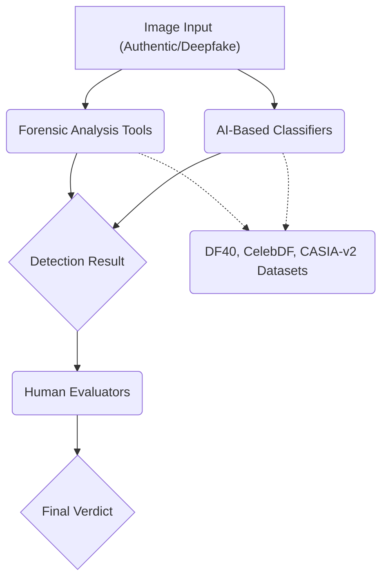

# 📄 Paper Digest: 2026-03-06

## How Effective Are Publicly Accessible Deepfake Detection Tools? A Comparative Evaluation of Open-Source and Free-to-Use Platforms

| 項目 | 詳細 |
|------|------|
| **著者** | Michael Rettinger, Ben Beaumont, Nhien-An Le-Khac, Hong-Hanh Nguyen-Le |
| **発表日** | 2026-03-06T00:00:00-05:00 |
| **分野** | セキュリティ |
| **arXiv** | [リンク](https://arxiv.org/abs/2603.04456) |
| **PDF** | [リンク](https://arxiv.org/pdf/2603.04456) |

---

### 🎓 前提知識

1.  **ディープフェイク (Deepfake)**：AI技術を使って、人物の顔や声を別の人物のものと合成する技術のこと。簡単に言えば、映画の特殊メイクをAIで自動化したようなものだ。昔は専門家しか作れなかったものが、今ではスマホアプリで誰でも作れるようになり、悪用されるリスクが高まっている。

2.  **フォレンジック分析 (Forensic Analysis)**：デジタルデータに残された痕跡から、改ざんや不正行為の有無を調査する手法。これは、まるで**犯罪現場の鑑識**のようなもので、画像のノイズパターンやメタデータなどを分析して、不自然な点がないかを探し出す。

3.  **AI分類器 (AI Classifier)**：AIを使って、入力されたデータを事前に学習したパターンに基づいて分類するモデル。**スパムメールフィルタ**をイメージすると分かりやすい。大量のメールを学習して、怪しい単語やパターンがあれば自動的にスパムと判定するのと同じように、ディープフェイク画像かどうかをAIが判断する。

### 📖 この研究が解こうとしている問題

ディープフェイク技術の進化によって、本物と見分けがつかない偽画像や動画が簡単に作れるようになった。その結果、SNSでのデマ拡散やなりすまし詐欺など、様々な問題が深刻化している。そこで重要になるのが、ディープフェイクを検知する技術だが、研究が進んでいるのは最先端のアルゴリズムばかりで、**現場の担当者が実際に使えるツール**の性能評価はほとんどなかった。例えば、警察官やジャーナリストが、目の前の画像が本物かどうかを判断する必要に迫られたとき、どのツールを使えば良いのか、どの程度信用できるのかが分からない。この研究は、実際に公開されているツールを使い、その性能を客観的に評価することで、現場の担当者がより適切にディープフェイクに対処できるようにすることを目指している。既存の手法では、ツールごとの得意不得意や、人間の判断とAIの判断が異なる場合にどうすれば良いのかが不明確だったのだ。

### 🔬 手法・アプローチ

この研究は、**公開されているディープフェイク検知ツールを、あえて「騙す」ようなテストを行い、その性能を比較評価する**アプローチだ。

具体的には、法執行機関の経験を持つ専門家が、6つのツール（フォレンジック分析ツールとAI分類器）を使って、本物、改ざんされた画像、AI生成画像の3種類のデータセットを検証した。ツールには、画像の出自に関する情報は一切与えられず、完全に「目隠し」された状態で評価される。そして、それぞれのツールがどの程度正確にディープフェイクを検知できるのかを、精度、再現率などの指標で定量的に評価した。さらに、ツールの判断と人間の判断が異なる場合に、どちらが正しいのかを分析することで、AIの限界と人間の優位性を明らかにした。

このアプローチのトレードオフとして、**最先端のアルゴリズムではなく、あくまで公開されているツールに焦点を当てている**点が挙げられる。そのため、研究結果が最先端技術の動向を完全に反映しているとは言えない。しかし、現場の担当者が実際に使えるツールに限定することで、**実用的な知見**を得られるというメリットがある。つまり、最先端の研究に比べると「即効性」が高い結果が得られるのだ。

### 🏗️ アーキテクチャ図

この図は、ディープフェイク検出のプロセスを示しています。入力画像はフォレンジック分析ツールとAI分類器の両方で処理され、その結果を元に人間の評価者が最終的な判断を下します。データセットは、ツールとAIの学習に使用されます。

### 💡 主要な貢献
*   **フォレンジックツールは高い再現率を示すが、特異度が低い** — 本物を偽物と誤判定する傾向があるため、証拠として利用するには注意が必要です。
*   **AI分類器は逆のパターンを示す** — 偽物を本物と見逃す可能性が高いため、こちらも単独での判断は危険です。
*   **人間の評価者は自動ツールを大幅に上回る** — 現状では、最終的な判断は人間の専門家が行うのが最も信頼性が高いと言えます。
*   **人間とAIの判断が一致しない場合、人間の判断が概ね正しい** — AIはまだ完璧ではなく、人間の経験や知識に基づいた判断が重要であることを示唆しています。

### 🌍 実務への応用可能性
この研究結果は、ディープフェイク対策を講じる様々な場面で応用できます。例えば、報道機関がニュース写真の真偽を確認する際、まずフォレンジックツールで疑わしい箇所を特定し、次にAI分類器で客観的な判断を仰ぎます。最終的な判断は、専門のジャーナリストが行うことで、誤情報を拡散するリスクを最小限に抑えられます。また、企業の広報担当者は、自社のブランドイメージを損なうディープフェイク動画がSNSで拡散された場合に、迅速な対応を行うための判断材料として活用できます。ツールだけでなく、人間の専門家による検証プロセスを組み込むことが重要です。さらに、この研究で用いられた評価手法は、自社で開発・運用するディープフェイク検出システムの性能評価にも応用可能です。

### 📚 関連キーワード
*   **Deep Learning** — ディープフェイクの生成・検出に用いられる機械学習の一分野。
*   **Generative Adversarial Networks (GANs)** — ディープフェイク生成に広く使われるニューラルネットワークアーキテクチャ。
*   **Explainable AI (XAI)** — AIの判断根拠を人間が理解できるようにする技術。ディープフェイク検出におけるAIの判断の信頼性を高めるために重要。
*   **Computer Vision** — 画像を解析し、意味のある情報を抽出するAI技術。ディープフェイク検出の基礎となる。
*   **Media Forensics** — デジタルメディアの信頼性や真正性を検証する分野。
*   **Adversarial Attacks** — AIモデルを誤認識させるように設計された入力データ。ディープフェイク検出ツールに対する脆弱性評価に用いられる。
*   **Synthetic Data Generation** — AIモデルの学習に使用される人工的に生成されたデータ。ディープフェイク検出モデルの訓練に利用可能。
*   **Blockchain** — メディアの出所や改ざん履歴を記録する分散型台帳技術。ディープフェイク対策として注目されている。

---
Auto-generated by Paper Digest workflow. Category: セキュリティ