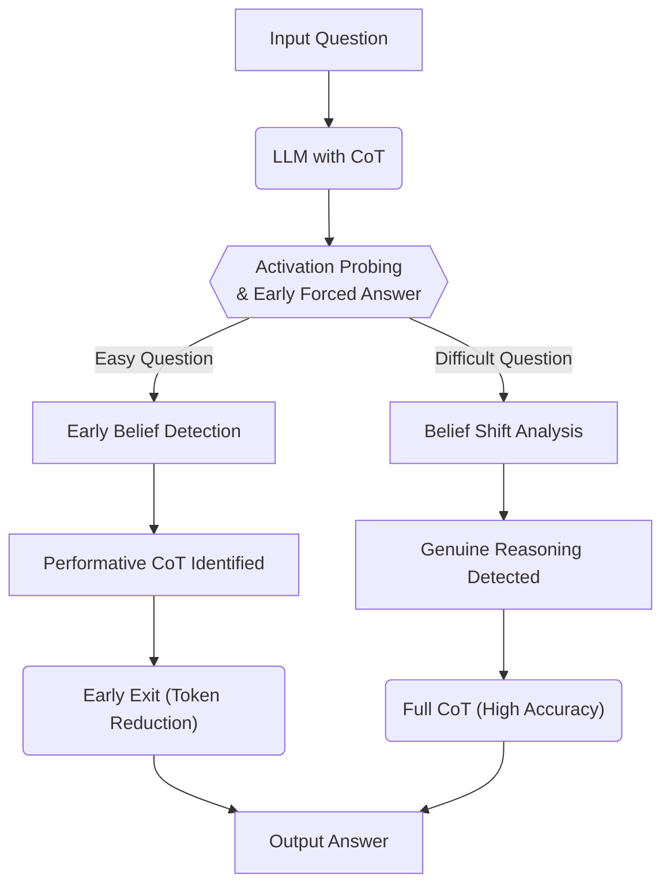

# 📄 Paper Digest: 2026-03-07

## Reasoning Theater: Disentangling Model Beliefs from Chain-of-Thought

| 項目 | 詳細 |
|------|------|
| **著者** | Siddharth Boppana, Annabel Ma, Max Loeffler, Raphael Sarfati, Eric Bigelow 他3名 |
| **発表日** | 2026-03-05T18:55:16Z |
| **分野** | AI |
| **arXiv** | [リンク](https://arxiv.org/abs/2603.05488v1) |
| **PDF** | [リンク](https://arxiv.org/pdf/2603.05488v1) |

---

### 🎓 前提知識

*   **Chain-of-Thought (CoT)**: 大規模言語モデル(LLM)に複雑な問題を解かせる際に、途中の思考過程をステップごとに生成させる手法。まるで、試験問題を解く時に途中式を書くようなものだ。CoTによって、LLMはより正確な答えを導き出せるようになる。
*   **Activation Probing**: LLMの内部状態（ニューロンの発火パターン）を観察し、モデルがどのような情報を処理しているかを分析する技術。人間の脳活動をfMRIで観察するようなものだ。特定のタスクに関連する情報が、モデルのどの部分にどのように表現されているかを知ることができる。
*   **Performative Behavior**: モデルが、実際には理解していなくても、あたかも理解しているかのように振る舞うこと。演劇で役者が、脚本を暗記して感情豊かに演じるが、必ずしもその感情を理解しているとは限らない、といった状況に近い。LLMがCoTを生成する際、必ずしも真に推論しているとは限らないという問題提起につながる。

### 📖 この研究が解こうとしている問題

LLMはChain-of-Thought（CoT）によって、複雑な推論タスクをこなせるようになった。しかし、CoTの表面的な「推論」に騙されてはいけない。LLMは、あたかも考えているかのように見せかける「演技」をしている可能性があるのだ。本当に推論しているのか、それとも単に学習データからパターンを模倣しているだけなのか？ この論文は、LLMがCoTを生成する過程で、いつ真の信念を持ち、いつ演技をしているのかを見分けようとしている。特に、簡単な問題では、表面的なCoTで正しい答えを導き出せても、難しい問題ではCoTが的外れになることがある。この問題を解決するために、モデルの内部状態を詳細に分析し、CoTが真の推論を反映しているのか、単なる「思考の劇場」なのかを解明する必要があるのだ。

### 🔬 手法・アプローチ

一言でいえば、**LLMの「思考の演技」を暴くために、内部状態の観察と早期推論の強制という二つのアプローチを組み合わせた研究**だ。

研究チームは、Activation Probingを使って、CoT生成の各段階でLLMがどのような情報を保持しているかを調べた。人間の脳波を測定するように、LLMの内部状態を読み取ることで、モデルがいつ答えを「確信」しているかを特定する。次に、Early Forced Answeringという手法を使い、CoTの初期段階で答えを強制的に出力させる実験を行った。もしモデルがCoTの初期段階ですでに正しい答えを知っていれば、その後のCoTは単なる「お飾り」である可能性が高い。難しい問題では、モデルが「アハ体験」や「バックトラック」といった行動を見せるかどうかを分析した。これらの行動は、モデルが真に推論し、試行錯誤している証拠となる。

このアプローチのトレードオフとして、内部状態の分析は計算コストが高く、すべてのモデルに適用できるわけではない。しかし、CoTの効率化とLLMの信頼性向上に大きく貢献できる。つまり、計算リソースを消費する代わりに、LLMの推論プロセスをより深く理解し、必要な計算量だけを実行させるという最適化に繋げられるのだ。

### 🏗️ アーキテクチャ図

この図は、論文におけるLLMのChain-of-Thought(CoT)の分析と、それに基づく早期終了のアーキテクチャを示しています。Activation ProbingとEarly Forced Answerを用いて、モデルの信念をCoTから分離し、タスクの難易度に応じて異なる処理を行います。

### 💡 主要な貢献
*   **簡単なタスクでは早期に信念が確定** — MMLUのような容易な問題では、CoTの初期段階で答えが予測可能であり、残りのCoTは形式的なものに過ぎない。
*   **難しいタスクでは信念の変化が重要** — GPQA-Diamondのような複雑な問題では、モデルの信念がCoTの過程で大きく変化し、真の推論が行われていることを示唆する。
*   **Activation Probingによる早期終了** — モデルの内部状態を監視することで、CoTの不要な部分をスキップし、トークン数を大幅に削減できる。
*   **推論の「劇場」現象の解明** — モデルが表面的な推論を演じている場合と、実際に推論している場合を区別するための手法を確立した。

### 🌍 実務への応用可能性

この研究成果は、LLMを活用した様々な実務アプリケーションにおいて、計算コストの削減と性能向上の両立に役立ちます。例えば、質問応答システムやドキュメント要約サービスにおいて、Activation Probingを用いてモデルの信念を監視し、早期に回答を生成することで、APIの利用料金を抑えつつ、応答速度を向上させることができます。また、CoTの生成過程を詳細に分析することで、モデルが誤った推論をしている箇所を特定し、より効果的なファインチューニングを行うことができます。既存のLLMOpsツール（例: Weights & Biases, MLflow）と連携し、モデルの内部状態を可視化・分析するパイプラインを構築することから始めるのが良いでしょう。さらに、LangChainなどのフレームワークを活用することで、Activation Probingの結果に基づいて、CoTの生成戦略を動的に変更するエージェントを開発することも可能です。

### 📚 関連キーワード
*   **Chain-of-Thought (CoT)**：大規模言語モデルに複雑な問題を解かせる際に、思考過程をステップごとに生成させる手法。
*   **Activation Probing**：モデルの内部状態を分析し、特定の情報がどのように表現されているかを理解する技術。
*   **Early Exit**：モデルが十分に確信を持った時点で、早期に処理を終了させることで、計算コストを削減する手法。
*   **Performative Reasoning**：モデルが実際には理解していなくても、あたかも推論しているかのように見せかけること。
*   **LLMOps**：大規模言語モデルの開発、デプロイ、運用を効率化するためのプラクティスとツール群。
*   **Interpretability**：機械学習モデルの動作原理や判断根拠を人間が理解できるようにする研究分野。
*   **Adaptive Computation**：入力データやタスクの難易度に応じて、計算リソースを動的に調整する技術。
*   **Knowledge Distillation**: 大きなモデルの知識を小さなモデルに転移させることで、計算効率を向上させる手法。

---
Auto-generated by Paper Digest workflow. Category: AI