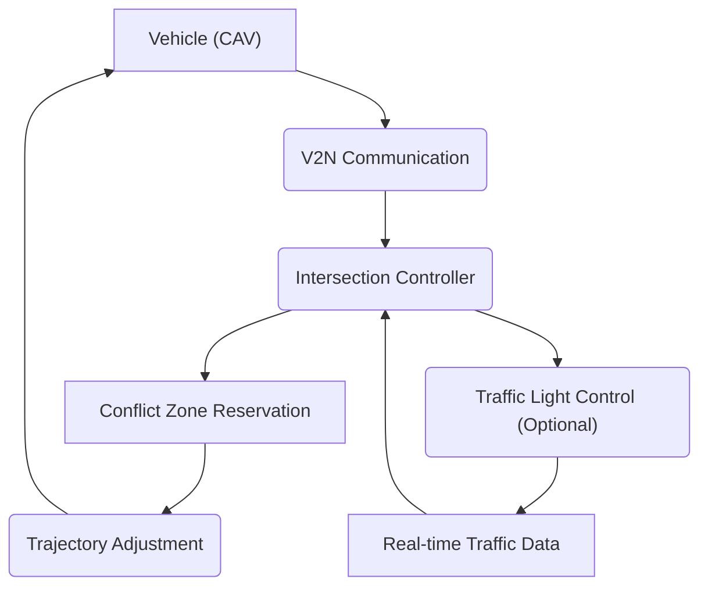

# 📄 Paper Digest: 2026-03-08

## V2N-Based Algorithm and Communication Protocol for Autonomous Non-Stop Intersections

| 項目 | 詳細 |
|------|------|
| **著者** | Lorenzo Farina, Lorenzo Mario Amorosa, Marco Rapelli, Barbara Maví Masini, Claudio Casetti 他1名 |
| **発表日** | 2026-03-05T13:35:32Z |
| **分野** | クラウド |
| **arXiv** | [リンク](https://arxiv.org/abs/2603.05165v1) |
| **PDF** | [リンク](https://arxiv.org/pdf/2603.05165v1) |

---

### 🎓 前提知識

*   **V2N（Vehicle-to-Network）通信**: 車両がネットワークを介して他の車両やインフラ（信号機など）と情報をやり取りする技術。**現実世界のたとえ:** 車がスマホアプリを使って、渋滞情報をリアルタイムに共有したり、ガソリンスタンドの場所を検索したりするようなもの。
*   **自律交差点管理**: 車両が自動運転で交差点を通過する際に、衝突を避け、スムーズな交通を実現するためのシステム。**現実世界のたとえ:** 航空管制官が飛行機の動きを指示して、空中で衝突が起こらないようにするのと同じようなことを、車に対して行うイメージ。
*   **決定論的衝突回避**: あらかじめ定められたルールやアルゴリズムに基づいて、衝突を確実に回避する手法。**現実世界のたとえ:** ロボット掃除機が、部屋の隅々まで掃除するために、あらかじめ決められたパターンで動くようなもの。

### 📖 この研究が解こうとしている問題

現代の交通システムにおいて、交差点はボトルネックであり、事故の多発地帯でもある。自動運転車（CAV）の導入は、この問題を解決する可能性を秘めているが、既存のアプローチには課題が多い。例えば、中央集権的な制御システムは、計算負荷が高く、リアルタイム処理が難しい。また、既存研究では、4Gや5Gといった実際の通信ネットワークの遅延を考慮していないことが多い。つまり、理想的な環境下ではうまくいくシステムでも、現実のネットワーク環境では性能が劣化する可能性があるのだ。もし、自動運転車の普及が進んだとしても、交差点での渋滞や事故が減らなければ、その恩恵は十分に得られない。この論文は、これらの問題を解決し、より安全で効率的な自動運転交通システムを実現しようとしている。

### 🔬 手法・アプローチ

**TL;DR:** 各車両に自律的な経路選択をさせつつ、交差点コントローラーが衝突を確実に防ぐV2N通信プロトコルを提案するアプローチである。

この論文では、"Moveover"という新しいアルゴリズムを提案している。Moveoverのポイントは、各CAVが自身の運動特性（速度や加速度など）に基づいて、最適な経路と速度プロファイルを個別に決定する点だ。つまり、各車が「私はこのルートで、この速度で交差点を通過したい」と宣言する。しかし、これだけでは衝突の危険性があるため、交差点にはローカルコントローラーを配置し、各車両の要求を調整して、衝突が発生しないように、交差点通過のための「予約」を管理する。この予約システムは、決定論的な衝突回避に基づいているため、ネットワークの遅延があっても、安全性を保証できる。また、シミュレーションでは、単車線、複数車線、ラウンドアバウトなど、さまざまな交差点レイアウトでMoveoverをテストし、さらに、実際の都市地図を用いた大規模なシミュレーションも実施している。

**トレードオフ:** Moveoverは、中央集権的な制御システムに比べて計算負荷を分散できるため、スケーラビリティが高いといえる。また、通信遅延を考慮した設計になっているため、現実のネットワーク環境でも高い性能を発揮する。一方で、各車両が自律的に経路を選択するため、全体的な交通最適化という点では、中央集権的なシステムに劣る可能性がある。しかし、論文では、旅行時間の短縮や排出ガスの削減といった点で、既存手法を大幅に上回る結果を示している。

### 🏗️ アーキテクチャ図

この図は、Moveoverアルゴリズムにおける車両と交差点制御の連携を示しています。車両はV2N通信を通じて交差点コントローラーに情報を送信し、コントローラーは衝突回避のために軌道調整を行い、必要に応じて交通信号を制御します。

### 💡 主要な貢献

*   **ノンストップ交差点通過アルゴリズムの実現** — 車両が停止せずに交差点を通過できる新しいアルゴリズムMoveoverを提案し、旅行時間の短縮と排出ガス削減に貢献する。
*   **V2N通信プロトコルの設計** — 車両と交差点コントローラー間の効率的な情報交換を可能にするV2N通信プロトコルを設計し、リアルタイムな交通状況への適応を支援する。
*   **分散型制御アーキテクチャの採用** — 各車両が自律的に経路を選択し、交差点コントローラーが衝突回避を行う分散型制御アーキテクチャを採用することで、中央集権型システムのスケーラビリティ問題を解決する。
*   **現実的なネットワーク環境の考慮** — 4Gおよび5G通信の遅延を考慮したシミュレーションを実施し、現実のネットワーク環境におけるアルゴリズムの有効性を検証する。
*   **多様な交差点レイアウトへの対応** — 単車線、複数車線、ラウンドアバウトなど、様々な交差点レイアウトでアルゴリズムの性能を評価し、実用的な適用範囲を示す。

### 🌍 実務への応用可能性

この研究の成果は、自動運転システムの開発やスマートシティの交通管理システムに直接応用できる可能性があります。Moveoverアルゴリズムは、既存の自動運転技術と組み合わせて、よりスムーズで安全な交差点通過を実現するために活用できます。たとえば、自動運転車の経路計画モジュールに組み込むことで、交差点における停止回数を減らし、燃費を向上させることができます。また、都市の交通管制システムに導入することで、リアルタイムな交通状況に応じて交差点の制御を最適化し、渋滞を緩和することも可能です。さらに、V2N通信プロトコルは、他の交通関連インフラ（信号機、道路標識など）との連携を容易にし、より高度な交通管理システムを構築するための基盤となります。読者が自身のプロジェクトに取り入れるとしたら、まずは小規模なシミュレーション環境でMoveoverアルゴリズムを実装し、既存の交通シミュレーターと連携させて性能評価を行うことから始めるのが良いでしょう。

### 📚 関連キーワード

*   **Autonomous Intersection Management (AIM)**: 自律的な車両が交差点を安全かつ効率的に通過するためのシステム全体の概念。
*   **Vehicle-to-Everything (V2X)**: 車両が他の車両、インフラ、歩行者など、あらゆるものと通信する技術の総称。
*   **Cooperative Perception**: 複数の車両がセンサーデータを共有し、より広い範囲の環境を認識する技術。
*   **DSRC/C-V2X**: 車両間通信に使用される無線通信規格。DSRC (Dedicated Short Range Communications) は従来の規格で、C-V2X (Cellular Vehicle-to-Everything) はセルラーネットワークを利用する新しい規格。
*   **Traffic Simulation (SUMO, Vissim)**: 交通流をモデル化し、アルゴリズムやシステムの効果を評価するためのソフトウェアツール。
*   **Edge Computing**: ネットワークのエッジに近い場所でデータ処理を行うことで、遅延を削減し、リアルタイム性を向上させる技術。交差点コントローラーへの適用が考えられる。
*   **Formal Verification**: ソフトウェアやハードウェアの設計が仕様通りに動作することを数学的に証明する手法。安全性クリティカルなシステムの開発に用いられる。
*   **Reinforcement Learning for Traffic Control**: 強化学習を用いて、交通信号の制御を最適化する手法。Moveoverと組み合わせることで、より高度な交通管理が可能になるかもしれない。

---
Auto-generated by Paper Digest workflow. Category: クラウド