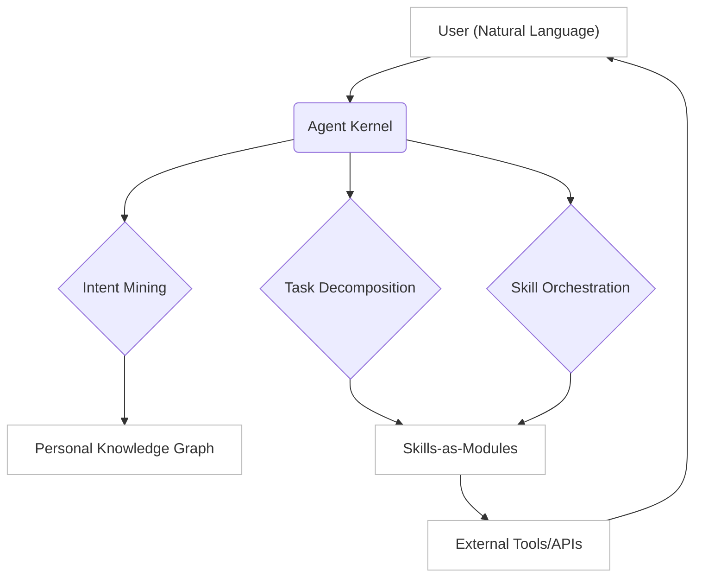

# 📄 Paper Digest: 2026-03-11

## AgentOS: From Application Silos to a Natural Language-Driven Data Ecosystem

| 項目 | 詳細 |
|------|------|
| **著者** | Rui Liu, Tao Zhe, Dongjie Wang, Zijun Yao, Kunpeng Liu 他3名 |
| **発表日** | 2026-03-11T00:00:00-04:00 |
| **分野** | AI |
| **arXiv** | [リンク](https://arxiv.org/abs/2603.08938) |
| **PDF** | [リンク](https://arxiv.org/pdf/2603.08938) |

---

### 🎓 前提知識

*   **大規模言語モデル (LLM) ベースのエージェント**: LLMを搭載し、まるで人間のように自然言語で指示を理解し、自律的にタスクを実行できるソフトウェアのこと。例えば、家電を操作するスマートスピーカーのように、複雑な指示を解釈して実行できる。
*   **自然言語インターフェース (NUI)**: キーボードやマウスといった従来のインターフェースの代わりに、自然言語（話し言葉や書き言葉）でコンピュータと対話する方式。カーナビに音声で目的地を伝えるように、直感的で学習コストが低いインターフェースを実現する。
*   **知識発見とデータマイニング (KDD)**: 大量のデータから有用なパターンや知識を抽出するプロセス。ECサイトの購買履歴から「〇〇を買う人は△△も買う」という傾向を見つけるように、隠れた情報を発見してビジネスに活用する。

### 📖 この研究が解こうとしている問題

現在のLLMエージェントは、従来のGUIやCLIを前提としたOS上で動いているため、色々な問題が起きている。例えば、OpenClawのようなツールを使っても、結局はマウス操作やコマンド入力の延長でしかない。まるで、スマホアプリをPCのエミュレーターで動かすような、ちょっと無理のある使い方だ。その結果、エージェント間の連携がスムーズにいかず、タスクごとにコンテキストが途切れてしまう。また、エージェントに与える権限管理も煩雑になりがちで、セキュリティ上のリスクも高まる。さらに、GUIやCLIというインターフェースがボトルネックとなり、エージェントのポテンシャルを十分に引き出せていない。そこで、この論文では、これらの問題を解決するために、自然言語を中心に据えた新しいOSのあり方を提案している。

### 🔬 手法・アプローチ

一言でいえば、GUI/CLIの代わりに自然言語をOSの主要インターフェースとして、LLMエージェントをOSの根幹に据えるアプローチである。

この論文では、従来のGUIデスクトップを廃止し、自然言語や音声を中心とした「自然言語ユーザーインターフェース (NUI)」を導入した「Personal Agent Operating System (AgentOS)」を提唱している。AgentOSの中核となるのは「Agent Kernel」と呼ばれるもので、これはユーザーの意図を解釈し、タスクを分解し、複数のエージェントを連携させる役割を担う。まるでオーケストラの指揮者のように、各エージェントをまとめ、全体として一つの目標を達成するイメージだ。また、従来のアプリケーションは「Skills-as-Modules」としてモジュール化され、ユーザーは自然言語ルールを使ってソフトウェアを組み合わせることができるようになる。このAgent Kernelを実現するため、知識発見とデータマイニング (KDD) の技術を活用し、ユーザーの行動パターンから意図を予測したり、最適なスキルを推薦したりする仕組みを構築する。

**トレードオフ:** AgentOSは、自然言語による直感的な操作や、エージェントの自律的な連携を可能にする一方で、高度な自然言語処理技術やデータマイニング技術を必要とするため、開発コストや計算コストが上がる可能性がある。また、ユーザーの意図を正確に解釈する必要があるため、誤認識による誤動作のリスクも考慮する必要があるだろう。

### 🏗️ アーキテクチャ図

この図は、AgentOSの基本的なアーキテクチャを示しています。ユーザーの自然言語による入力はAgent Kernelで処理され、意図解釈、タスク分解、スキル連携を経て、外部ツールやAPIと連携し、最終的にユーザーに応答を返します。Personal Knowledge Graphは、Intent Miningの精度向上に貢献します。

### 💡 主要な貢献

*   **AgentOSパラダイムの提唱** — 従来のGUI/CLIベースのOSから、自然言語を中心としたエージェント駆動型のOSへの移行を提案し、新たなコンピューティングのあり方を示唆した。
*   **Agent Kernelの概念定義** — ユーザーの意図解釈、タスク分解、エージェント連携を担うAgent Kernelという中核コンポーネントを定義し、その役割と必要機能を示した。
*   **Skills-as-Modulesの導入** — 従来のアプリケーションをモジュール化されたスキルとして再定義し、自然言語ルールによるソフトウェアの組み合わせを可能にする新しいソフトウェア開発パラダイムを提示した。
*   **KDD技術の応用** — AgentOSの実現における知識発見とデータマイニングの重要性を強調し、具体的な応用例（ワークフロー自動化、スキル推薦、知識グラフ構築）を示した。

### 🌍 実務への応用可能性

この研究の成果は、実務において様々な応用が考えられます。例えば、カスタマーサポートの自動化において、AgentOSの概念を応用することで、より自然な対話を通じて顧客のニーズを理解し、適切な情報やサービスを提供できるようになります。また、RPA（Robotic Process Automation）の分野では、自然言語によるタスク定義とエージェントの連携により、複雑な業務プロセスの自動化をより柔軟かつ効率的に実現できます。既存のLLMフレームワーク（LangChain、LlamaIndexなど）と連携させることで、高度な自然言語処理能力を組み込むことが可能です。自身のプロジェクトに取り入れる第一歩として、まずは既存のアプリケーションをSkills-as-Modulesの考え方でモジュール化し、自然言語による連携を試してみるのが良いでしょう。

### 📚 関連キーワード

*   **自然言語処理 (NLP)**: 人間の言語をコンピュータが理解・処理するための技術。AgentOSの中核となる自然言語インターフェースの実現に不可欠。
*   **大規模言語モデル (LLM)**: 大量のテキストデータで学習された、高度な自然言語生成・理解能力を持つモデル。GPT-3、BERTなどが代表的。
*   **知識グラフ (Knowledge Graph)**: エンティティ（人、場所、概念など）とその関係性を表現するグラフ構造のデータベース。AgentOSにおけるPersonal Knowledge Graphの基盤となる。
*   **LangChain**: LLMを活用したアプリケーション開発を支援するフレームワーク。AgentOSにおけるエージェントの構築や連携に利用できる。
*   **意図解釈 (Intent Recognition)**: ユーザーの発話やテキストから、その意図を正確に理解するタスク。Agent Kernelの重要な機能の一つ。
*   **スキルストア (Skill Store)**: モジュール化されたスキル（アプリケーション機能）を登録・検索・利用できるプラットフォーム。AgentOSにおけるSkills-as-Modulesの実現に必要。
*   **RPA (Robotic Process Automation)**: 定型的な業務プロセスをソフトウェアロボットで自動化する技術。AgentOSにおけるタスク自動化の応用分野。

---
Auto-generated by Paper Digest workflow. Category: AI